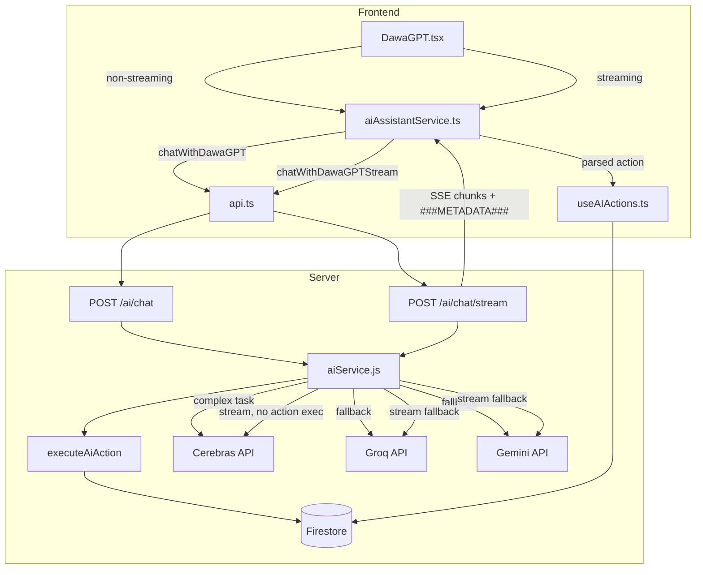
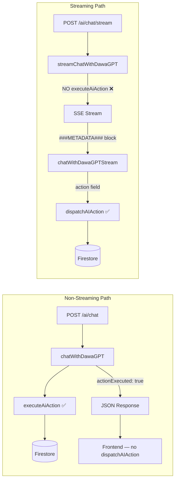
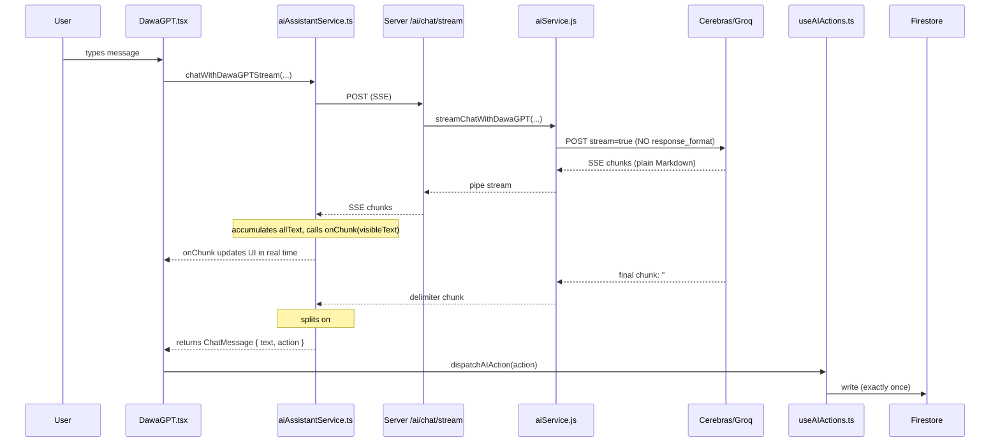
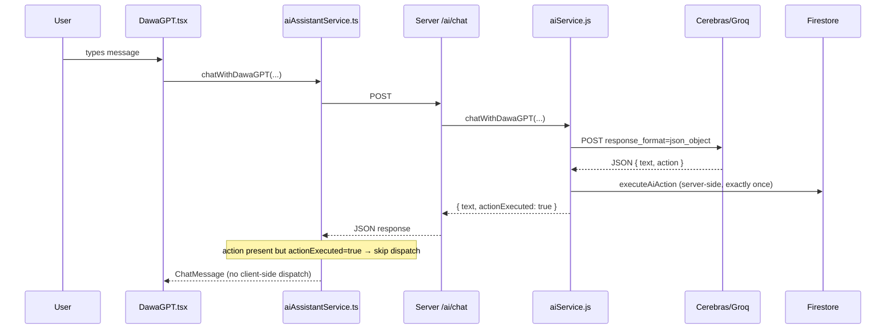
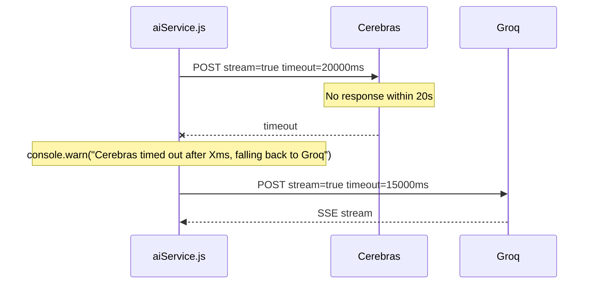

# Design Document: DawaGPT Cerebras Fix

## Overview

This document covers targeted fixes to the DawaGPT conversational AI pipeline to resolve
streaming incompatibilities, duplicate action execution, silent delete failures, model routing
gaps, and misleading error codes. The changes span the server AI service, the frontend
streaming parser, the action dispatcher hook, and server startup logging. No architectural
rewrites are required — each fix is surgical and isolated to the identified root cause.

---

## Architecture

### High-Level Component Diagram



### Action Execution Ownership (Critical Invariant)



**Rule**: Firestore is written to exactly once per user request. The non-streaming path writes
server-side; the streaming path writes client-side. These paths must never both write for the
same request.

---

## Components and Interfaces

### Component 1: `server/src/services/aiService.js`

**Purpose**: Core AI orchestration — model selection, prompt construction, streaming, action execution.

**Changes**:

#### 1a. Cerebras Key Startup Logging (`server/src/index.js`)

Add a startup check immediately after `dotenv.config()` resolves:

```javascript
// After dotenv.config() in index.js
if (process.env.CEREBRAS_API_KEY) {
  console.log('✅ Cerebras: active');
} else {
  console.warn('⚠️  Cerebras: not configured — falling back to Groq');
}
```

#### 1b. `callCerebrasChat` — Fix Error Status Code

**Current** (line ~113):
```javascript
throw new AppError('Cerebras API key not configured', 401);
```

**Fixed**:
```javascript
throw new AppError('Cerebras API key not configured', 503);
```

Rationale: 401 means "unauthorized" (bad credentials). A missing key means the service is
unavailable in this environment — 503 is semantically correct and triggers the fallback chain
without surfacing an auth error to the user.

#### 1c. `callCerebrasChat` — Increase Non-Streaming Timeout

**Current**: `timeout: 8000`
**Fixed**: `timeout: 15000`

#### 1d. `streamChatWithDawaGPT` — Remove `response_format` from Streaming Requests

**Current** (inside the streaming `fn` closure):
```javascript
response_format: { type: 'json_object' }
```

**Fixed**: Remove this field entirely when `stream: true`. Cerebras and Groq do not support
`response_format: json_object` alongside streaming — it causes stalls and garbled output.

```javascript
const response = await axios.post(apiUrl, {
  model: model,
  messages: finalMessages,
  stream: true,
  ...(isCerebras
    ? { max_completion_tokens: chatMaxTokens }
    : { max_tokens: chatMaxTokens }),
  // response_format intentionally omitted for streaming
}, {
  headers: { 'Authorization': `Bearer ${key}`, 'Content-Type': 'application/json' },
  responseType: 'stream',
  timeout: isCerebras ? 20000 : 15000  // 20s for Cerebras streaming, 15s for Groq
});
```

#### 1e. `streamChatWithDawaGPT` — Cerebras Streaming Timeout

**Current**: `timeout: isCerebras ? 8000 : 15000`
**Fixed**: `timeout: isCerebras ? 20000 : 15000`

Streaming responses take longer to begin than non-streaming ones. 20 s gives Cerebras enough
runway before falling back to Groq.

#### 1f. Fallback Logging with Elapsed Time

When Cerebras times out, log at `warn` level with elapsed time:

```javascript
const cerebrasStart = Date.now();
try {
  // ... cerebras call
} catch (cerebrasErr) {
  const elapsed = Date.now() - cerebrasStart;
  console.warn(`DawaGPT Stream: Cerebras timed out after ${elapsed}ms, falling back to Groq.`, cerebrasErr.message);
}
```

#### 1g. `isComplexTask` — Add Missing Patterns

**Current gaps**:
- Delete/remove intent (`delete`, `remove`, `cancel`, `stop`) + domain noun is not explicitly
  matched — it relies on the generic `hasActionVerb` regex which includes `delete`/`remove`
  but the `hasDomainNoun` regex misses `alarm` and `reminder` in some forms.
- "Show reminders" / "list reminders" patterns fall through because `hasDataVerb` matches
  `show`/`list` but `hasDomainNoun` does not include `reminder(s)` explicitly.

**Fixed logic** (additions highlighted):

```javascript
const isComplexTask = (text) => {
  if (!text) return false;
  const lower = text.toLowerCase().trim();

  if (text.length > 500) return true;

  // Guard: informational queries are NOT complex
  const isHowToQuery = /^(how\s+do\s+i|can\s+you\s+explain|what\s+is|tell\s+me\s+about)/i.test(lower);
  if (isHowToQuery) return false;

  // NEW: Delete/remove intent + domain noun
  const hasDeleteIntent = /(delete|remove|cancel|stop)\s+\w*\s*(reminder|alarm|med|medicine)/i.test(lower);
  if (hasDeleteIntent) return true;

  // NEW: Show/list reminders intent
  const hasShowRemindersIntent = /(show|list|what\s+are|check|view)\s+\w*\s*reminders?/i.test(lower);
  if (hasShowRemindersIntent) return true;

  // Existing patterns (preserved)
  const hasActionVerb = /(add|create|set|remind|log|record|track|update|delete|remove|register)/i.test(lower);
  const hasDomainNoun = /(reminder|med|medicine|dose|log|wellness|family|profile|patient|history)/i.test(lower);
  const hasDataVerb = /(what|show|list|tell|view|check|get)/i.test(lower);

  const isActionRequest = hasActionVerb && hasDomainNoun;
  const isDataRequest = hasDataVerb && (hasDomainNoun || /(my|current|active|recent)/i.test(lower));

  if (isActionRequest || isDataRequest) return true;

  const isMedicalQuery = /(dose|dosage|effect|safe|interact|symptom|pain|sick|hurt|doctor|health)/i.test(lower);
  if (isMedicalQuery && text.split(' ').length > 5) return true;

  return false;
};
```

#### 1h. Streaming System Prompt — New Format

The streaming path (`isStreaming: true`) uses a **different system prompt** from the
non-streaming path. The streaming prompt instructs the model to output plain Markdown text
followed by a `###METADATA###` delimiter and a single-line JSON block. It must NOT instruct
the model to respond in JSON mode.

**Streaming system prompt tail** (replaces the `=== RESPONSE FORMAT ===` section):

```
=== STREAMING RESPONSE FORMAT ===
Write your response as plain Markdown text.
At the very end, on a new line, append exactly:

###METADATA###
{"suggestions":["...","..."],"source":"Dawa-GPT","action":{"type":"...","payload":{...}}}

Rules:
- The ###METADATA### line must be the LAST thing you output.
- The JSON must be on a single line immediately after ###METADATA###.
- If no action is needed, set "action" to null.
- Do NOT wrap your response in a JSON object. Only the metadata block is JSON.
- Do NOT include any text after the metadata JSON line.
```

**Non-streaming system prompt tail** (unchanged):

```
=== RESPONSE FORMAT ===
Respond STRICTLY in JSON format, with the "text" field containing Markdown-formatted content.
NEVER append text outside the JSON block.

Structure:
{
  "text": "Your markdown response here",
  "suggestions": ["suggestion 1", "2", "3"],
  "source": "Dawa-GPT",
  "action": { "type": "...", "payload": {...} } | null
}
```

The `prepareDawaGPTContext` function already accepts `isStreaming` — the conditional prompt
tail is added inside that function based on the flag.

---

### Component 2: `src/services/aiAssistantService.ts`

**Purpose**: Frontend streaming consumer — reads SSE chunks, assembles text, parses metadata.

**Change**: Replace the fragile mid-stream JSON detection with `###METADATA###` delimiter splitting.

**Current approach** (fragile):
```typescript
const metadataStart = allText.search(/\{[\s\n]*"(?:suggestions|source)"/);
if (metadataStart !== -1) {
  cleanText = allText.substring(0, metadataStart).trim();
  tempMetadata = allText.substring(metadataStart);
}
```

**Fixed approach**:
```typescript
// After the read loop completes, split on the delimiter
const METADATA_DELIMITER = '###METADATA###';
const delimiterIndex = allText.indexOf(METADATA_DELIMITER);

let displayText: string;
let rawMetadata: string;

if (delimiterIndex !== -1) {
  displayText = allText.substring(0, delimiterIndex).trim();
  rawMetadata = allText.substring(delimiterIndex + METADATA_DELIMITER.length).trim();
} else {
  // Delimiter absent — treat entire text as display text, no metadata
  displayText = allText.trim();
  rawMetadata = '';
}

fullText = displayText;

// Parse metadata safely
let metadata: StreamMetadata = { suggestions: [], source: 'Gemini', action: undefined };
if (rawMetadata) {
  try {
    metadata = JSON.parse(rawMetadata);
  } catch (e) {
    console.warn('Failed to parse stream metadata JSON', e);
    // Graceful degradation: return text with empty metadata
  }
}
```

**During streaming** (the `onChunk` callback): call `onChunk` with the portion of `allText`
before any `###METADATA###` occurrence, so the delimiter never appears in the UI:

```typescript
// Inside the chunk processing loop
allText += content;
const delimIdx = allText.indexOf('###METADATA###');
const visibleText = delimIdx !== -1
  ? allText.substring(0, delimIdx)
  : allText;
onChunk(visibleText);
```

**Graceful degradation** (Requirement 2.4): If `rawMetadata` is empty or `JSON.parse` throws,
the function returns the full streamed text with `suggestions: []` and `action: undefined`.
No error is thrown or displayed.

---

### Component 3: `src/hooks/useAIActions.ts`

**Purpose**: Dispatches AI-requested actions to AppContext (Firestore writes on the client side).

#### 3a. `REMOVE_REMINDER` — Add Fuzzy Name-Matching Fallback

**Current** (no fallback):
```typescript
case "REMOVE_REMINDER":
  await deleteReminder(payload.id);
  // ...
```

**Fixed** (mirrors `UPDATE_REMINDER` pattern):
```typescript
case "REMOVE_REMINDER": {
  let targetId = payload.id;

  // Fuzzy fallback: if id is absent, search by medicineName
  if (!targetId && payload.medicineName) {
    const match = reminders.find(r =>
      r.medicineName.toLowerCase() === payload.medicineName.toLowerCase()
    );
    if (match) targetId = match.id;
  }

  if (!targetId) {
    throw new Error(
      `Could not find a reminder for ${payload.medicineName || 'the specified medicine'}`
    );
  }

  await deleteReminder(targetId);
  toast({
    title: '✅ Reminder removed',
    description: action.confirmMessage || 'The reminder has been deleted.',
  });
  break;
}
```

#### 3b. Improved Error Messages

**Current** (generic):
```typescript
description: (e as Error).message || "I couldn't complete that action. Please try manually."
```

**Fixed** (specific failure reason surfaced):
```typescript
description: (e as Error).message || "Action failed. Please try again or do it manually."
```

Since `REMOVE_REMINDER` and `UPDATE_REMINDER` now throw descriptive errors (e.g.
`"Could not find a reminder for Paracetamol"`), the `catch` block will surface that message
directly in the toast.

#### 3c. Unknown Action Type — Improved Warning

**Current**:
```typescript
default:
  console.warn("Unknown AI action type:", action.type);
```

**Fixed**:
```typescript
default:
  console.warn("Unknown AI action type:", action.type);
  toast({
    title: "⚠️ Unsupported action",
    description: "DawaGPT tried an unsupported action. Please try rephrasing your request.",
    variant: "destructive",
  });
```

---

### Component 4: `server/.env.example`

Add the missing `CEREBRAS_API_KEY` entry under the AI Service Keys section:

```dotenv
# AI Service Keys
GEMINI_API_KEY="your-gemini-api-key"
GROQ_API_KEY="your-groq-api-key"
GROQ_API_KEY_2="your-groq-api-key-2"
GROQ_API_KEY_3="your-groq-api-key-3"
CEREBRAS_API_KEY="your-cerebras-api-key"  # Optional: enables fast 120B model for complex tasks
```

---

### Component 5: `server/src/test-isComplexTask.js` (New File)

Unit tests for `isComplexTask` to prevent regressions. Since `isComplexTask` is not currently
exported, it will be exported (or the test file will import the function via a test-only export).

**Test cases** (minimum 8):

| Input | Expected |
|---|---|
| `"delete my Paracetamol reminder"` | `true` |
| `"remove the Metformin alarm"` | `true` |
| `"show my reminders"` | `true` |
| `"list all reminders"` | `true` |
| `"add a reminder for Coartem at 8am"` | `true` |
| `"what are my current reminders?"` | `true` |
| `"how do I add a reminder?"` | `false` |
| `"can you explain what Metformin does?"` | `false` |
| `"log my Paracetamol dose"` | `true` |
| `"I have a headache"` | `false` |

---

## Data Models

### Streaming Response Format

The streaming path produces two logical segments separated by the `###METADATA###` delimiter:

```
[Plain Markdown text — displayed to user in real time]

###METADATA###
{"suggestions":["..."],"source":"Dawa-GPT","action":{"type":"ADD_REMINDER","payload":{...}}}
```

**Constraints**:
- `###METADATA###` appears exactly once, on its own line, at the very end of the stream.
- The JSON after the delimiter is a single line (no newlines inside the JSON object).
- If no action is needed: `"action": null`.
- The delimiter and JSON block are never shown in the UI.

### Non-Streaming Response Format (unchanged)

```json
{
  "text": "Markdown-formatted response",
  "suggestions": ["chip 1", "chip 2"],
  "source": "Dawa-GPT",
  "action": {
    "type": "ADD_REMINDER",
    "payload": { "medicineName": "Paracetamol", "dose": "500mg", "time": "08:00", "repeatSchedule": "daily" }
  }
}
```

### `AIAction` Payload — `REMOVE_REMINDER`

The system prompt instructs the model to always include `id` when the reminder list is in
context. The client-side fallback handles the case where `id` is absent:

```typescript
// Priority order for REMOVE_REMINDER target resolution:
// 1. payload.id (Firestore document ID — preferred)
// 2. reminders.find(r => r.medicineName.toLowerCase() === payload.medicineName.toLowerCase())
// 3. throw Error("Could not find a reminder for [medicineName]")
```

---

## Sequence Diagrams

### Streaming Path — Happy Path



### Non-Streaming Path — Happy Path



### Cerebras Timeout Fallback



---

## Error Handling

### Error Scenario 1: Missing Cerebras API Key

**Condition**: `CEREBRAS_API_KEY` is not set in the environment.
**Server startup**: Logs `⚠️  Cerebras: not configured — falling back to Groq`. Server continues.
**Runtime**: `callCerebrasChat` throws `AppError('Cerebras API key not configured', 503)`.
**Fallback**: The `try/catch` around the Cerebras call in `chatWithDawaGPT` and
`streamChatWithDawaGPT` catches the 503 and falls through to Groq.
**User impact**: None — Groq handles the request transparently.

### Error Scenario 2: Streaming Stall / Garbled Output

**Condition**: `response_format: json_object` was passed with `stream: true`.
**Fix**: Remove `response_format` from all streaming requests.
**Result**: Clean plain-text SSE stream; `###METADATA###` delimiter reliably separates
display text from metadata.

### Error Scenario 3: `###METADATA###` Absent or Malformed

**Condition**: Model omits the delimiter, or the JSON after it is malformed.
**Frontend behaviour**: `delimiterIndex === -1` → `displayText = allText`, `rawMetadata = ''`.
`JSON.parse('')` is not called. `metadata` defaults to `{ suggestions: [], source: 'Gemini', action: undefined }`.
**User impact**: Full streamed text is shown; no action is dispatched; no error toast.

### Error Scenario 4: `REMOVE_REMINDER` with No ID

**Condition**: AI returns `{ type: 'REMOVE_REMINDER', payload: { medicineName: 'Paracetamol' } }` (no `id`).
**Client behaviour**: Fuzzy search finds reminder by `medicineName`. If found, deletes it.
If not found, throws `"Could not find a reminder for Paracetamol"`.
**Toast**: Shows the specific error message, not a generic fallback.

### Error Scenario 5: Cerebras Timeout

**Condition**: Cerebras does not respond within 15 000 ms (non-streaming) or 20 000 ms (streaming).
**Server behaviour**: `console.warn` with elapsed time. Falls back to Groq.
**User impact**: Slight latency increase; response still arrives via Groq.

### Error Scenario 6: Unknown AI Action Type

**Condition**: AI returns an action type not in the switch statement.
**Client behaviour**: `console.warn` + toast: "DawaGPT tried an unsupported action. Please try rephrasing your request."

### Error Scenario 7: Network / 5xx on Streaming

**Condition**: Server returns 5xx or network drops during streaming.
**Client behaviour**: `catch` in `chatWithDawaGPTStream` returns:
`"Connection lost. Please check your internet and try again."`

---

## Testing Strategy

### Unit Testing Approach

- `server/src/test-isComplexTask.js`: Tests `isComplexTask` with ≥ 8 representative inputs
  covering delete intent, show-reminders intent, how-to queries, and medical queries.
- `useAIActions.ts` `REMOVE_REMINDER` branch: Test with `payload.id` present, absent with
  matching name, and absent with no match.

### Property-Based Testing Approach

**Property Test Library**: fast-check (frontend), or plain Node.js assertions (server).

See the Correctness Properties section below.

### Integration Testing Approach

- Verify that a streaming request to `/ai/chat/stream` does not trigger `executeAiAction`
  server-side (check that Firestore write count = 0 on the server for a streaming request
  that includes an action).
- Verify that a non-streaming request to `/ai/chat` does trigger `executeAiAction` exactly
  once.

---

## Performance Considerations

- Removing `response_format: json_object` from streaming requests eliminates the stall that
  caused perceived slowness. No additional latency is introduced.
- Increasing the Cerebras non-streaming timeout from 8 s to 15 s means the fallback to Groq
  takes up to 7 s longer in the worst case. This is acceptable because Cerebras is only tried
  for complex tasks, and the 120B model is significantly more capable for those tasks.
- The streaming Cerebras timeout of 20 s is appropriate because streaming responses begin
  emitting tokens faster than non-streaming responses complete — the first token typically
  arrives within 2–4 s even if the full response takes longer.

---

## Security Considerations

- `CEREBRAS_API_KEY` is read from `process.env` at module load time and never logged or
  exposed in responses. The startup log only confirms presence/absence, not the key value.
- The 503 status code for a missing key prevents the error from being misinterpreted as an
  authentication failure by monitoring tools or the fallback chain.
- No new external endpoints or data flows are introduced.

---

## Dependencies

No new dependencies are required. All changes use existing libraries:
- `axios` (server HTTP client)
- `AppError` (server error utility)
- `fast-check` (optional, for property tests — already available or trivially added)

---

## Correctness Properties

*A property is a characteristic or behavior that should hold true across all valid executions
of a system — essentially, a formal statement about what the system should do. Properties
serve as the bridge between human-readable specifications and machine-verifiable correctness
guarantees.*

### Property 1: Streaming output never contains `###METADATA###` in visible text

*For any* streaming response from the server, the text delivered to `onChunk` callbacks and
the final `ChatMessage.text` field must not contain the string `###METADATA###` or any
characters from the metadata JSON block.

**Validates: Requirements 2.2, 2.3**

### Property 2: Metadata delimiter split is lossless

*For any* complete streamed string of the form `[displayText]###METADATA###[metadataJson]`,
splitting on `###METADATA###` and reassembling must recover the original `displayText` and
`metadataJson` exactly (no characters lost or duplicated).

**Validates: Requirements 2.3**

### Property 3: Graceful degradation on absent or malformed metadata

*For any* streamed string that does not contain `###METADATA###`, or where the JSON after
the delimiter is not valid JSON, `chatWithDawaGPTStream` must return a `ChatMessage` with
non-empty `text`, `suggestions: []`, and `action: undefined` — and must not throw.

**Validates: Requirements 2.4**

### Property 4: `REMOVE_REMINDER` fuzzy match correctness

*For any* reminders array and any `medicineName` string that matches exactly one reminder
(case-insensitively), the `REMOVE_REMINDER` handler must resolve to that reminder's `id`
and call `deleteReminder` with it — regardless of whether `payload.id` is present.

**Validates: Requirements 4.1**

### Property 5: `REMOVE_REMINDER` fails descriptively when no match exists

*For any* reminders array and any `medicineName` that does not match any reminder
(case-insensitively), and when `payload.id` is also absent, the `REMOVE_REMINDER` handler
must throw an `Error` whose message contains the `medicineName`.

**Validates: Requirements 4.2**

### Property 6: `isComplexTask` classifies delete+domain as complex

*For any* string containing a delete/remove intent word (`delete`, `remove`, `cancel`, `stop`)
adjacent to a domain noun (`reminder`, `alarm`, `med`, `medicine`), `isComplexTask` must
return `true`.

**Validates: Requirements 5.1**

### Property 7: `isComplexTask` classifies show-reminders as complex

*For any* string containing a read/list intent word (`show`, `list`, `what are`, `check`,
`view`) adjacent to `reminder` or `reminders`, `isComplexTask` must return `true`.

**Validates: Requirements 5.2**

### Property 8: `isComplexTask` preserves how-to guard

*For any* string beginning with `how do i`, `can you explain`, `what is`, or
`tell me about`, `isComplexTask` must return `false`.

**Validates: Requirements 5.3**

### Property 9: Single Firestore write per user request

*For any* user request sent via the streaming path, the number of Firestore writes
attributable to that request must be exactly 0 on the server side and at most 1 on the
client side (0 if no action, 1 if action present).

*For any* user request sent via the non-streaming path, the number of Firestore writes
must be exactly 1 on the server side and 0 on the client side.

**Validates: Requirements 3.1, 3.2, 3.4**
