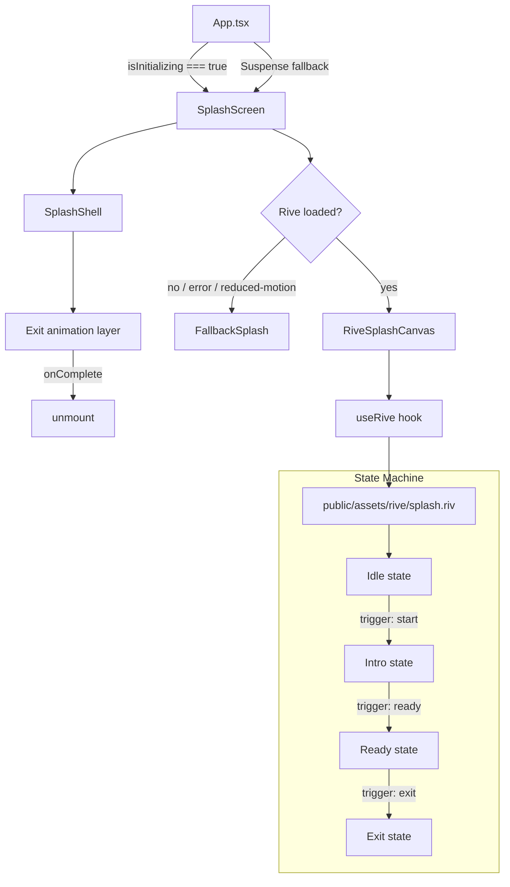
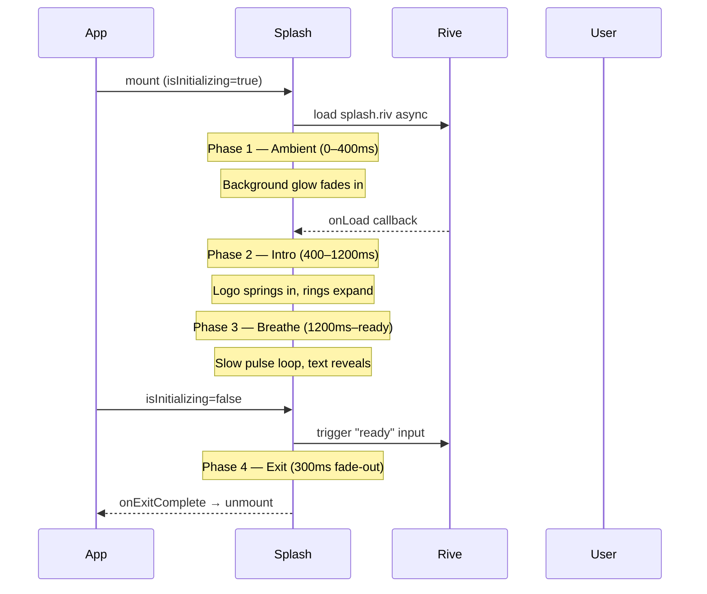
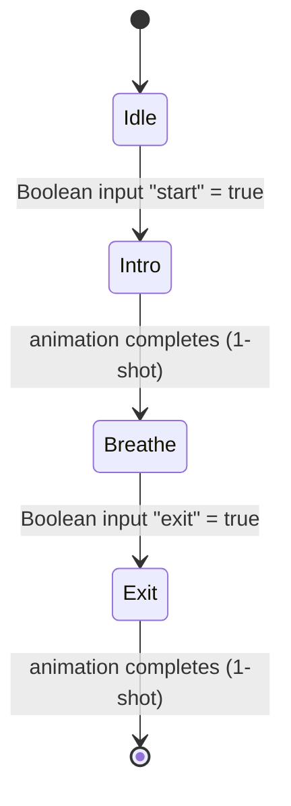
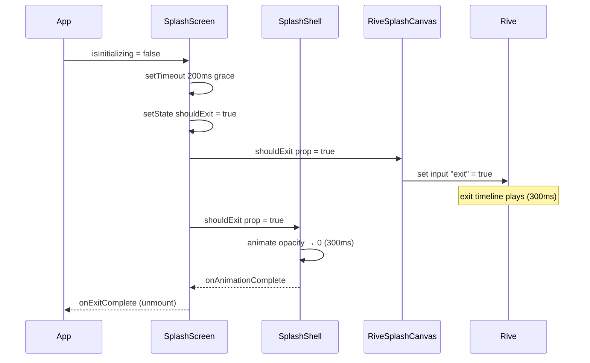

# Design Document: Splash Screen Redesign

## Overview

Replace the existing Framer Motion–only splash screen with an elegant, health-focused experience that uses a Rive animation as its visual centrepiece. The redesigned splash communicates trust, precision, and calm — qualities that matter in a medicine management app — while loading asynchronously so it never blocks first paint. A seamless Framer Motion fallback activates automatically if the Rive asset fails to load or if the user has `prefers-reduced-motion` enabled.

The new screen is composed of three layered concerns: the Rive artboard (visual centrepiece), a React shell that manages lifecycle and exit, and a CSS/Framer Motion fallback that mirrors the same aesthetic without the `.riv` dependency.

---

## Architecture

See the component architecture diagram and state machine design in the High-Level Design section below.

## Components and Interfaces

See the TypeScript interfaces and component implementation details in the Low-Level Design section below.

## Data Models

See the Rive artboard specification and TypeScript state interfaces in the Low-Level Design section below.

## Correctness Properties

### Property 1: No blank frame on mount
For any render of `SplashScreen`, the background colour `#050505` is applied synchronously on the first frame — no blank white flash occurs before animations start.

### Property 2: Fallback always visible on Rive error
If `RiveAnimation.onError` fires, `riveError` becomes `true` and `FallbackSplash` renders within the same React commit — there is no moment where neither Rive nor fallback is visible.

### Property 3: Reduced-motion path skips Rive entirely
When `prefers-reduced-motion` is `true`, the `.riv` file is never fetched and `FallbackSplash` renders directly, with Framer Motion's own reduced-motion handling applied.

### Property 4: Exit fires exactly once
`onExitComplete` is called exactly once per splash lifecycle — `shouldExit` is a one-way boolean and `SplashShell.onAnimationComplete` is the single callback source.

### Property 5: Rive asset does not block first paint
The Rive asset fetch is non-blocking — `RiveAnimation` initiates the fetch after mount, so the shell and fallback render synchronously on the first frame regardless of network speed.

## Error Handling

See the fallback mechanism and Rive error handling in the Low-Level Design section below.

## Testing Strategy

See the Testing Strategy section in the Low-Level Design section below.

---

## High-Level Design

### Visual Concept & Aesthetic Direction

The design language is **"medical-grade calm"** — the visual vocabulary of a premium health app rather than a generic tech product.

| Principle | Expression |
|---|---|
| Precision | Thin concentric rings, exact spacing, no decorative noise |
| Calm | Slow breathing pulse (3–4 s cycle), no jarring transitions |
| Trust | Teal brand colour on near-black; high contrast, accessible |
| Organic | Soft radial glows, rounded shapes, fluid easing curves |
| Minimal | One focal point (logo + animation), everything else recedes |

**Colour palette (splash-specific):**

| Token | Hex | Usage |
|---|---|---|
| `--splash-bg` | `#050505` | Full-screen background |
| `--teal-bright` | `#22c9cc` | Primary glow, ring strokes, active dots |
| `--teal-mid` | `#1a9ca0` | Secondary glow, loading indicator |
| `--teal-dim` | `rgba(26,156,160,0.12)` | Ambient radial fill |
| `--white-text` | `#ffffff` | App name |
| `--white-sub` | `rgba(255,255,255,0.38)` | Tagline |

**Typography:**
- App name: system-ui / `-apple-system` stack, weight 400, `clamp(1.9rem, 7.5vw, 2.55rem)`, letter-spacing `0.05em`
- Tagline: same stack, `0.67rem`, weight 400, letter-spacing `0.26em`, uppercase

---

### Architecture Overview



**Component responsibilities:**

| Component | File | Responsibility |
|---|---|---|
| `SplashScreen` | `src/components/SplashScreen.tsx` | Orchestrator — owns lifecycle, exit trigger, reduced-motion gate |
| `RiveSplashCanvas` | `src/components/splash/RiveSplashCanvas.tsx` | Thin wrapper around `RiveAnimation` with splash-specific props |
| `FallbackSplash` | `src/components/splash/FallbackSplash.tsx` | Pure CSS + Framer Motion fallback, mirrors Rive visual |
| `SplashShell` | `src/components/splash/SplashShell.tsx` | Shared layout shell (background, safe-area, z-index) |
| `splash.riv` | `public/assets/rive/splash.riv` | Rive artboard — built in Rive editor |

---

### Animation Timeline & Phases



**Phase breakdown:**

| Phase | Duration | What happens |
|---|---|---|
| **0 — Mount** | 0 ms | Shell renders, background `#050505` is instant (no flash) |
| **1 — Ambient** | 0–400 ms | Radial glow fades in; Rive asset fetches in background |
| **2 — Intro** | 400–1200 ms | Logo springs in (scale 0.7→1, opacity 0→1); concentric rings expand outward; app name assembles letter-by-letter |
| **3 — Breathe** | 1200 ms → app ready | Slow breathing pulse on logo glow (3.5 s cycle); sonar ring repeats; tagline and loading dots visible |
| **4 — Exit** | 300 ms | Whole splash fades to opacity 0, scale 1→1.04 (subtle zoom-out feel); `onExitComplete` fires |

---

### Rive State Machine Design

The `.riv` file contains a single artboard named **`SplashArtboard`** with one state machine named **`SplashSM`**.



**State machine inputs:**

| Input name | Type | Default | Trigger condition |
|---|---|---|---|
| `start` | Boolean | `false` | Set to `true` immediately on mount |
| `exit` | Boolean | `false` | Set to `true` when `isInitializing` becomes `false` |

**Artboard layers (bottom → top):**

| Layer | Type | Description |
|---|---|---|
| `bg-glow` | Shape (ellipse) | Radial fill `#1a9ca0` at 8% opacity, blurred; slow opacity breathe |
| `ring-outer` | Shape (circle stroke) | 110 px radius, 0.5 px stroke `#22c9cc` at 15%; expands on Intro |
| `ring-mid` | Shape (circle stroke) | 72 px radius, 0.5 px stroke `#22c9cc` at 20%; expands on Intro |
| `sonar` | Shape (circle stroke) | 45 px radius, 1 px stroke `#22c9cc`; scale 1→2.6, opacity 0.65→0 loop |
| `logo-glow` | Shape (circle fill) | 92 px diameter, radial fill `#22c9cc` at 20%, blurred; breathe pulse |
| `logo-image` | Image | `/logo.png` 76×76 px; spring-in on Intro |
| `dot-orbit` | Group (3 dots) | 3.5 px dots at radius 58 px, rotating CW 7 s/rev |
| `cross-hair` | Shape (4 thin lines) | Subtle medical cross-hair at 5% opacity; fades in during Breathe |

**Animations in the artboard:**

| Animation name | Type | Duration | Loop |
|---|---|---|---|
| `idle` | Timeline | 1 frame | — |
| `intro` | Timeline | 800 ms | No (1-shot) |
| `breathe` | Timeline | 3500 ms | Yes |
| `exit` | Timeline | 300 ms | No (1-shot) |

---

### Responsive & Safe-Area Considerations

- The splash shell uses `position: fixed; inset: 0` — covers the full viewport including notch/status bar areas.
- The Rive canvas is centred with `width: min(280px, 70vw); height: min(280px, 70vw)` — scales down on small screens without distorting.
- Text below the canvas uses `clamp()` for font sizes.
- Bottom loading indicator sits above `env(safe-area-inset-bottom, 20px)` to avoid home-indicator overlap on iOS.
- On Android with `StatusBar.setOverlaysWebView({ overlay: true })` (already configured in App.tsx), the splash extends behind the status bar — the near-black background makes the status bar icons readable without any extra styling.

---

## Low-Level Design

### TypeScript Interfaces

```typescript
// src/components/SplashScreen.tsx

interface SplashScreenProps {
  /** Called after the exit animation fully completes. Parent uses this
   *  to unmount the splash and reveal the app. Currently App.tsx drives
   *  visibility via isInitializing; this prop is for future explicit control. */
  onExitComplete?: () => void;
}

// src/components/splash/RiveSplashCanvas.tsx

interface RiveSplashCanvasProps {
  /** Fired when the Rive asset has loaded and the intro animation starts */
  onRiveReady?: () => void;
  /** Fired if the Rive asset fails to load — parent switches to fallback */
  onRiveError?: () => void;
  /** When true, triggers the "exit" state machine input */
  shouldExit: boolean;
  /** Fired when the Rive exit animation completes */
  onExitComplete?: () => void;
}

// src/components/splash/FallbackSplash.tsx

interface FallbackSplashProps {
  /** When true, triggers the Framer Motion exit animation */
  shouldExit: boolean;
  /** Fired when the exit animation completes */
  onExitComplete?: () => void;
}

// src/components/splash/SplashShell.tsx

interface SplashShellProps {
  children: React.ReactNode;
  /** Controls the whole-shell exit fade (opacity 0, scale 1.04) */
  shouldExit: boolean;
  onExitComplete?: () => void;
}

// Internal state shape inside SplashScreen

interface SplashState {
  riveLoaded: boolean;   // true once Rive onLoad fires
  riveError: boolean;    // true if Rive fails — activates fallback
  shouldExit: boolean;   // true when isInitializing becomes false
}
```

---

### Rive Artboard Specification (for Rive Editor)

This section is the exact brief for building `splash.riv` in the [Rive editor](https://rive.app).

**Artboard:**
- Name: `SplashArtboard`
- Size: `400 × 400` (logical pixels; canvas scales to fit)
- Background: transparent (shell provides `#050505`)
- Origin: centre `(200, 200)`

**State Machine:**
- Name: `SplashSM`
- Inputs:
  - `start` — Boolean, default `false`
  - `exit` — Boolean, default `false`

**Layers (Rive hierarchy):**

```
SplashArtboard
├── bg-glow          [Ellipse, fill #1a9ca0 8%, blur 60px]
├── ring-outer       [Ellipse stroke, r=110, stroke #22c9cc 15%, 0.5px]
├── ring-mid         [Ellipse stroke, r=72, stroke #22c9cc 20%, 0.5px]
├── sonar            [Ellipse stroke, r=45, stroke #22c9cc, 1px]
├── logo-glow        [Ellipse fill, r=46, radial #22c9cc→transparent, blur 20px]
├── logo-image       [Image asset, 76×76, centred at origin]
├── dot-orbit        [Group]
│   ├── dot-0        [Ellipse fill #22c9cc, r=1.75, positioned at (0, -58)]
│   ├── dot-1        [Ellipse fill #22c9cc, r=1.75, positioned at (0, -58), rotated 120°]
│   └── dot-2        [Ellipse fill #22c9cc, r=1.75, positioned at (0, -58), rotated 240°]
└── cross-hair       [Group, opacity 5%]
    ├── h-line       [Rectangle, 40×0.5, fill #22c9cc]
    └── v-line       [Rectangle, 0.5×40, fill #22c9cc]
```

**Timeline: `idle`**
- 1 frame, all layers at rest values.

**Timeline: `intro`** (800 ms, 1-shot, triggered by `start=true`)

| Layer | Property | 0 ms | 400 ms | 800 ms | Easing |
|---|---|---|---|---|---|
| `logo-image` | opacity | 0 | — | 1 | easeOut |
| `logo-image` | scale | 0.7 | — | 1.0 | spring (stiffness 200, damping 20) |
| `logo-glow` | opacity | 0 | — | 0.2 | easeOut |
| `ring-outer` | scale | 0.3 | — | 1.0 | easeOut |
| `ring-mid` | scale | 0.3 | — | 1.0 | easeOut (delay 80 ms) |
| `dot-orbit` | opacity | 0 | — | 0.88 | easeOut |
| `bg-glow` | opacity | 0 | — | 0.08 | easeIn |

**Timeline: `breathe`** (3500 ms, loop, plays after `intro` completes)

| Layer | Property | 0 ms | 1750 ms | 3500 ms | Easing |
|---|---|---|---|---|---|
| `logo-glow` | scale | 1.0 | 1.12 | 1.0 | easeInOut |
| `logo-glow` | opacity | 0.18 | 0.28 | 0.18 | easeInOut |
| `sonar` | scale | 1.0 | 2.6 | 1.0 | easeOut then instant reset |
| `sonar` | opacity | 0.65 | 0 | 0.65 | easeOut then instant reset |
| `dot-orbit` | rotation | 0° | 180° | 360° | linear |
| `cross-hair` | opacity | 0.05 | 0.10 | 0.05 | easeInOut |

**Timeline: `exit`** (300 ms, 1-shot, triggered by `exit=true`)

| Layer | Property | 0 ms | 300 ms | Easing |
|---|---|---|---|---|
| All layers | opacity | current | 0 | easeIn |

---

### Component Implementation Details

#### `SplashScreen.tsx` (updated orchestrator)

```typescript
// Lifecycle logic — pseudocode

const SplashScreen: React.FC<SplashScreenProps> = ({ onExitComplete }) => {
  const { isInitializing } = useApp()
  const prefersReducedMotion = useReducedMotion()   // from framer-motion

  const [state, setState] = useState<SplashState>({
    riveLoaded: false,
    riveError: false,
    shouldExit: false,
  })

  // Watch isInitializing — when it flips to false, trigger exit
  useEffect(() => {
    if (!isInitializing && !state.shouldExit) {
      // Small grace delay so the breathe animation completes at least one cycle
      const t = setTimeout(() => setState(s => ({ ...s, shouldExit: true })), 200)
      return () => clearTimeout(t)
    }
  }, [isInitializing])

  const useRive = !state.riveError && !prefersReducedMotion

  return (
    <SplashShell shouldExit={state.shouldExit} onExitComplete={onExitComplete}>
      {useRive ? (
        <RiveSplashCanvas
          shouldExit={state.shouldExit}
          onRiveReady={() => setState(s => ({ ...s, riveLoaded: true }))}
          onRiveError={() => setState(s => ({ ...s, riveError: true }))}
          onExitComplete={onExitComplete}
        />
      ) : (
        <FallbackSplash
          shouldExit={state.shouldExit}
          onExitComplete={onExitComplete}
        />
      )}
    </SplashShell>
  )
}
```

**Key decisions:**
- `useReducedMotion()` from Framer Motion (already a dependency) — no new import needed.
- `riveError` flag routes to fallback without any visible glitch because `FallbackSplash` renders the same visual structure.
- The 200 ms grace delay prevents the exit from firing before the Rive intro animation has had time to play.

---

#### `RiveSplashCanvas.tsx`

```typescript
// Wraps the existing RiveAnimation component with splash-specific wiring

const RiveSplashCanvas: React.FC<RiveSplashCanvasProps> = ({
  onRiveReady,
  onRiveError,
  shouldExit,
  onExitComplete,
}) => {
  const [inputs, setInputs] = useState({ start: false, exit: false })

  // Trigger "start" on mount (next tick so Rive is initialised)
  useEffect(() => {
    const t = setTimeout(() => setInputs(i => ({ ...i, start: true })), 50)
    return () => clearTimeout(t)
  }, [])

  // Trigger "exit" when parent signals
  useEffect(() => {
    if (shouldExit) setInputs(i => ({ ...i, exit: true }))
  }, [shouldExit])

  // Listen for Rive exit animation completion via onStateChange
  // The exit timeline is 300 ms — fire onExitComplete after that
  useEffect(() => {
    if (!shouldExit) return
    const t = setTimeout(() => onExitComplete?.(), 350)
    return () => clearTimeout(t)
  }, [shouldExit])

  return (
    <RiveAnimation
      src="/assets/rive/splash.riv"
      artboard="SplashArtboard"
      stateMachine="SplashSM"
      inputs={inputs}
      onLoad={onRiveReady}
      onError={onRiveError}
      fit={Fit.Contain}
      alignment={Alignment.Center}
      className="w-full h-full"
      fallback={<FallbackSplash shouldExit={shouldExit} onExitComplete={onExitComplete} />}
    />
  )
}
```

**Note on `fallback` prop:** The existing `RiveAnimation` component already accepts a `fallback` ReactNode that renders while loading. Passing `FallbackSplash` here means the visual is never blank — the fallback shows during the Rive fetch, then Rive takes over seamlessly once loaded.

---

#### `FallbackSplash.tsx`

Mirrors the Rive visual using only Framer Motion and CSS. Preserves the existing animation logic from the current `SplashScreen.tsx` but restructured as a standalone component:

- Ambient radial glow (CSS `radial-gradient`, Framer Motion fade-in)
- Logo spring-in with pulsing halo
- 3 orbital dots (existing `OrbitalDot` component, extracted to `src/components/splash/OrbitalDot.tsx`)
- Sonar ring (existing `SonarRing` component, extracted to `src/components/splash/SonarRing.tsx`)
- Letter-by-letter app name reveal
- Tagline fade-in
- Wave loading dots

Exit: when `shouldExit=true`, wraps everything in a Framer Motion `animate={{ opacity: 0, scale: 1.04 }}` with `transition={{ duration: 0.3 }}`, then calls `onExitComplete`.

---

#### `SplashShell.tsx`

```typescript
// Provides the fixed full-screen container and the whole-shell exit animation

const SplashShell: React.FC<SplashShellProps> = ({
  children,
  shouldExit,
  onExitComplete,
}) => (
  <motion.div
    className="fixed inset-0 z-[9999] flex flex-col items-center justify-center overflow-hidden"
    style={{ background: '#050505' }}
    animate={shouldExit ? { opacity: 0 } : { opacity: 1 }}
    transition={{ duration: 0.3, ease: 'easeIn' }}
    onAnimationComplete={() => { if (shouldExit) onExitComplete?.() }}
  >
    {children}
  </motion.div>
)
```

The shell owns the exit fade so both Rive and fallback paths share the same dismissal animation. This prevents a double-fade if both the Rive exit timeline and the shell fade run simultaneously — the shell fade is the authoritative exit.

---

### Exit Animation Mechanism



The shell fade and the Rive exit timeline run in parallel (both 300 ms). The shell's `onAnimationComplete` is the single source of truth for unmounting — no race condition.

---

### Integration with App.tsx

No changes to `App.tsx` are required. The existing usage pattern is preserved:

```typescript
// App.tsx — existing pattern, unchanged
if (isInitializing) {
  return <SplashScreen />;
}

// Suspense fallback — unchanged
<Suspense fallback={<SplashScreen />}>
```

`SplashScreen` reads `isInitializing` from `useApp()` internally (already does this in `ProtectedRoute`). The component is self-contained — it knows when to exit without the parent needing to pass a prop.

**One optional enhancement** (non-breaking): add `onExitComplete` prop support so future callers can hook into the exit if needed. The default behaviour (no prop) is identical to today.

---

### File Structure Changes

```
src/
└── components/
    ├── SplashScreen.tsx          ← UPDATED (orchestrator, slimmed down)
    └── splash/                   ← NEW directory
        ├── RiveSplashCanvas.tsx  ← NEW
        ├── FallbackSplash.tsx    ← NEW (extracted from old SplashScreen)
        ├── SplashShell.tsx       ← NEW
        ├── OrbitalDot.tsx        ← NEW (extracted from old SplashScreen)
        └── SonarRing.tsx         ← NEW (extracted from old SplashScreen)

public/
└── assets/
    └── rive/
        └── splash.riv            ← NEW (built in Rive editor)
```

**What moves vs what's new:**
- `OrbitalDot` and `SonarRing` are extracted from the current `SplashScreen.tsx` into their own files — no logic changes, just co-location.
- `FallbackSplash` is the current `SplashScreen` body, refactored to accept `shouldExit` / `onExitComplete` props.
- `SplashScreen.tsx` becomes a thin orchestrator (~60 lines) instead of a 300-line monolith.
- `RiveSplashCanvas` and `SplashShell` are new.

---

### Correctness Properties

**P1 — No blank frame on mount**
For any render of `SplashScreen`, the background colour `#050505` is applied synchronously via inline style on the shell div. The Rive asset and Framer Motion animations are additive — they layer on top of an already-visible background.

**P2 — Fallback always activates on Rive error**
If `onError` fires on `RiveAnimation`, `riveError` is set to `true` and `FallbackSplash` renders. The `fallback` prop on `RiveAnimation` also covers the loading window, so there is no moment where neither Rive nor fallback is visible.

**P3 — Reduced-motion path skips Rive entirely**
When `prefersReducedMotion === true`, `useRive` is `false` before any Rive hook is called. The `.riv` file is never fetched. `FallbackSplash` renders with its own reduced-motion handling (Framer Motion respects `prefers-reduced-motion` natively via `useReducedMotion`).

**P4 — Exit fires exactly once**
`shouldExit` is a one-way boolean flag (`false → true`, never back). `SplashShell.onAnimationComplete` is the single callback that fires `onExitComplete`. Even if both Rive and the shell complete simultaneously, only one `onExitComplete` call reaches the parent.

**P5 — Rive asset does not block first paint**
`RiveAnimation` uses `useRive` from `@rive-app/react-canvas` which fetches the `.riv` file asynchronously after mount. The shell and fallback render synchronously on the first frame.

**P6 — Safe-area coverage on all devices**
`fixed inset-0` covers the full viewport. No content is clipped by notches or home indicators because the loading indicator has `padding-bottom: env(safe-area-inset-bottom, 20px)`.

---

### Testing Strategy

**Unit tests** (`vitest` + `@testing-library/react`):
- `SplashShell` renders children and applies exit animation class when `shouldExit=true`
- `FallbackSplash` calls `onExitComplete` after 300 ms when `shouldExit=true`
- `SplashScreen` switches to `FallbackSplash` when `riveError=true`
- `SplashScreen` sets `shouldExit=true` within 300 ms of `isInitializing` becoming `false`

**Property-based tests** (`fast-check`, already installed):
- For any sequence of `isInitializing` values `[true, ..., false]`, `onExitComplete` is called exactly once
- For any `shouldExit` value, `SplashShell` never renders with `opacity > 0` after `onAnimationComplete` fires

**Manual / visual QA checklist:**
- [ ] iOS: splash covers status bar and home indicator
- [ ] Android: splash covers status bar (overlay mode)
- [ ] Rive loads and plays intro → breathe → exit correctly
- [ ] Kill network → Rive fails → fallback renders without blank frame
- [ ] Enable "Reduce Motion" in OS settings → fallback renders, no Rive fetch
- [ ] App initialises in < 1 s → exit fires before breathe loop completes (graceful)
- [ ] App initialises in > 5 s → breathe loop plays multiple cycles, exit fires correctly

---

### Dependencies

No new npm dependencies required. All tools are already installed:

| Dependency | Version | Usage |
|---|---|---|
| `@rive-app/react-canvas` | `^4.28.6` | Rive runtime |
| `framer-motion` | `^12.38.0` | Fallback animations, `useReducedMotion` |
| `react` | `^18.3.1` | Component model |
| `@capacitor/splash-screen` | `^8.0.1` | Native splash (already hidden in `main.tsx`) |

The only external deliverable is the `splash.riv` file, which must be built in the [Rive editor](https://rive.app) following the artboard specification above and placed at `public/assets/rive/splash.riv`.
