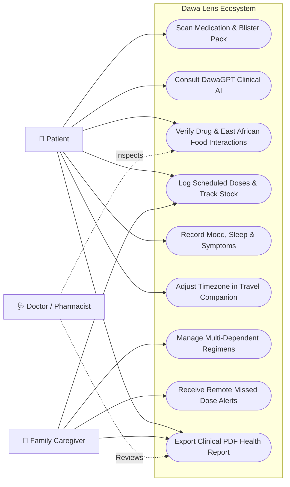
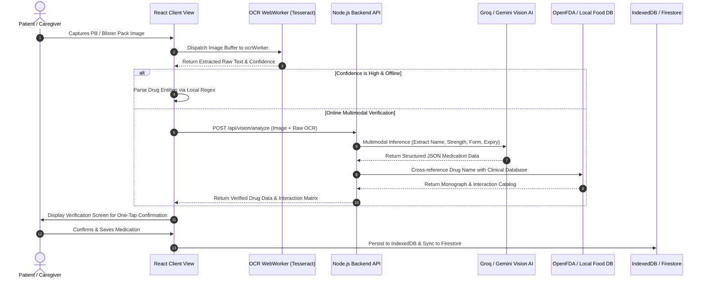
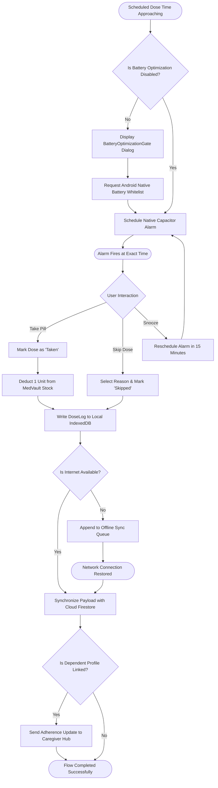
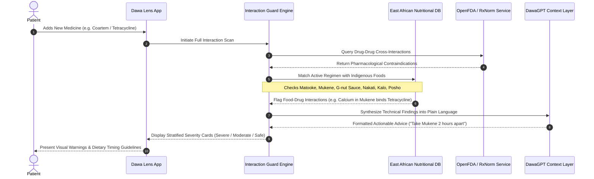
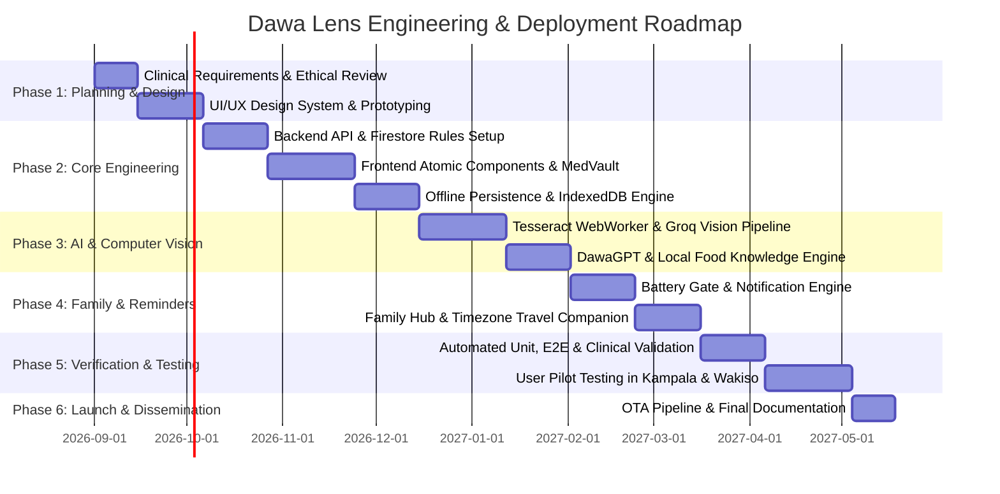

# Project Proposal: Dawa Lens — Intelligence-Driven Medication Safety, Adherence, and Family Care Ecosystem

---

## 1. Executive Summary

The proposed project, entitled **Dawa Lens**, will design, architect, and deploy an intelligent, offline-first medication safety and adherence ecosystem engineered specifically to address the unique healthcare challenges of East Africa and emerging global markets. By integrating high-performance edge computing, on-device optical character recognition (OCR), multimodal artificial intelligence, and localized pharmacological intelligence, Dawa Lens will transform any standard smartphone into a context-aware personal clinical companion.

The platform will eliminate preventable medication errors, bridge severe health literacy gaps, and safeguard patients against hazardous drug-drug and drug-food interactions involving indigenous East African diets. Furthermore, through an integrated Family Hub, Dawa Lens will provide multi-generational families and caregivers with real-time, synchronized oversight of vulnerable dependents. Built on an offline-first architectural paradigm utilizing React 18, Vite, Capacitor 8, Node.js, and Firebase Cloud Firestore, Dawa Lens will deliver reliable medication schedules and clinical guidance even in environments characterized by intermittent network connectivity and low-cost Android hardware.

---

## 2. Introduction, Background & Regional Healthcare Context

In Uganda and across the broader East African Community (EAC), healthcare delivery continues to experience significant structural fragmentation, particularly within outpatient clinical management, chronic disease care, and pharmaceutical distribution. The prevailing regional healthcare model requires citizens to navigate a dispersed continuum of public health centers, private clinics, community pharmacies, and informal drug dispensaries. Because centralized Electronic Health Record (EHR) systems remain non-existent for the vast majority of the population, longitudinal medical histories and active medication profiles reside exclusively in the physical possession of patients or their immediate family members.

```
+-----------------------------------------------------------------------------+
|               The Fragmented Healthcare Landscape in East Africa            |
+-----------------------------------------------------------------------------+
|                                                                             |
|   +-------------------+    +--------------------+    +------------------+   |
|   |  Public Referral  |    |  Private Clinics   |    | Local Community  |   |
|   |    Hospitals      |    |  & Dispensaries    |    |    Pharmacies    |   |
|   +---------+---------+    +---------+----------+    +--------+---------+   |
|             |                        |                        |             |
|             \________________________|________________________/             |
|                                      |                                      |
|                                      v                                      |
|                     +----------------------------------+                    |
|                     |        The Patient / Family      |                    |
|                     |  (No Unified Records, Manual     |                    |
|                     |   Prescriptions, Complex Dosing) |                    |
|                     +----------------------------------+                    |
|                                                                             |
+-----------------------------------------------------------------------------+
```

Consequently, the burden of managing multi-drug regimens, identifying unlabelled generic packaging, recognizing contraindications, and adhering strictly to complex dosing schedules falls entirely upon patients and domestic caregivers. This dynamic is exacerbated by several socio-technical factors:

1. **Polypharmacy in Multi-Morbidity Management**: Chronic conditions such as hypertension, diabetes, and cardiovascular diseases frequently co-occur with infectious diseases including HIV/AIDS, malaria, and tuberculosis. Patients are routinely prescribed complex combinations of antiretrovirals (ARVs), Artemisinin-based Combination Therapies (ACTs), antihypertensives, and antibiotics, dramatically elevating the risk of adverse drug reactions (ADRs).
2. **Profligacy of Generic and Unbranded Packaging**: Pharmacies frequently dispense generic formulations in plain blister strips or unlabelled envelopes without accompanying patient information leaflets (PILs). Patients unable to decipher pharmaceutical nomenclature frequently take incorrect dosages or discontinue therapy prematurely.
3. **Localized Dietary Interactions**: Standard clinical databases evaluate drug interactions against Western dietary staples, ignoring indigenous East African foods. Common regional foods—such as steamed green bananas (*Matooke*), millet bread (*Kalo*), silver fish (*Mukene*), groundnut stew (*G-nut sauce*), and indigenous greens (*Nakati*, *Dodo*)—contain biochemical properties that alter drug bioavailability, yet patients receive no systematic warnings regarding these food-drug interactions.
4. **Hardware and Infrastructure Constraints**: Mobile users across East Africa predominantly utilize entry-level to mid-tier Android smartphones produced by manufacturers (such as Transsion/Tecno/Infinix, Xiaomi, and Samsung) whose aggressive operating system battery-saving algorithms kill background tasks, rendering standard reminder alarms non-functional. Furthermore, frequent network blackouts and high mobile data costs make cloud-dependent applications impractical.

With mobile phone penetration in Uganda exceeding 70% and rapid advancements in lightweight edge machine learning models, an unprecedented opportunity exists to build a localized, intelligent, and highly resilient mobile health platform. Dawa Lens will bridge these critical systemic gaps.

---

## 3. Problem Statement & Motivation

Despite the proliferation of digital health applications globally, existing solutions fail to provide effective medication safety and adherence management within developing regions. Western-centric applications (such as Medisafe and MyTherapy) operate on assumptions of uninterrupted high-speed 4G/5G connectivity, comprehensive national drug registries (e.g., US NDC or UK BNF), high baseline health literacy, and Western dietary habits. When deployed within East Africa, these applications break down: they cannot recognize regional generic brands, they fail to sound alarms when background processes are terminated by low-RAM Android skins, and they offer zero insight into local dietary contraindications.

Medication non-adherence and adverse drug events (ADEs) represent major drivers of preventable morbidity, mortality, antimicrobial resistance (AMR), and emergency hospital readmissions across Sub-Saharan Africa. Furthermore, multi-generational households place an unsustainable mental burden on primary caregivers who must coordinate the daily treatments of aging parents and young children without shared tools. 

The motivation behind Dawa Lens is to engineer an accessible, culturally competent, and technically robust clinical safety net. By providing on-device computer vision, context-aware artificial intelligence, localized nutritional knowledge, offline data persistence, and family synchronization, Dawa Lens will empower every patient and caregiver with the expertise of a dedicated, vigilant personal pharmacist.

---

## 4. Project Aim and Specific Objectives

### 4.1 Primary Aim
The primary aim of this project will be to design, develop, evaluate, and deploy **Dawa Lens** — an offline-first, intelligence-driven medication safety, adherence tracking, and family caregiving ecosystem tailored to the clinical, linguistic, and infrastructural realities of East Africa.

### 4.2 Specific Objectives
To achieve this primary aim, the project will execute the following specific engineering and research objectives:

1. **Develop an Edge-Optimized Computer Vision & OCR Module**: The system will implement a dual-tier medication recognition pipeline utilizing client-side Tesseract.js in dedicated Web Workers for instant text extraction, paired with cloud multimodal Vision LLMs (Groq Llama Vision and Google Gemini 2.0 Flash) to identify pills, blister strips, and handwritten prescription slips.
2. **Build DawaGPT — A Context-Aware Clinical Conversational Agent**: The platform will construct an empathetic, multi-turn AI assistant capable of translating complex medical leaflets into plain, culturally tailored language, analyzing symptoms, and enforcing strict clinical guardrails and emergency escalation protocols.
3. **Formulate an East African Drug & Local Food Interaction Guard**: The project will develop an intelligent cross-referencing engine combining international clinical databases (OpenFDA, RxNorm) with a specialized East African Nutritional Knowledge Base to proactively detect dangerous drug-drug combinations and dietary contraindications (e.g., *Mukene* with Tetracyclines, *Nakati* with Warfarin, *G-nut sauce* with *Coartem*).
4. **Engineer an Offline-First Persistence & Sync Architecture**: The application will implement a robust client-side storage architecture utilizing IndexedDB, TanStack Query, and Cloud Firestore offline caching to ensure zero-latency read/write access during complete internet outages, with automatic background delta-synchronization upon network restoration.
5. **Implement a Resilient Notification & Battery Optimization Defense System**: The system will build a native Capacitor alarm pipeline capable of bypassing aggressive Android OEM battery-killing mechanisms to guarantee on-time local reminder delivery across all smartphone tiers.
6. **Construct a Collaborative Family Hub & Caregiver Network**: The platform will provide a secure multi-profile management framework enabling caregivers to remotely monitor medication adherence, verify dose logs, and receive instant alerts regarding skipped critical doses for elderly relatives or pediatric dependents.
7. **Develop an Adaptive Travel Companion Engine**: The system will integrate an automated timezone recalculation algorithm that dynamically adjusts interval-based medication regimens during trans-meridian travel, preventing accidental double-dosing or missed therapeutic windows.
8. **Create a Holistic Wellness Journal & Clinical PDF Report Generator**: The platform will incorporate daily biometric, symptom, and mood logging with interactive Recharts visualizations, coupled with an automated one-click PDF generation engine producing structured, doctor-ready clinical summaries for hospital and pharmacy visits.

---

## 5. Justification and Significance of the Study

The development of Dawa Lens holds profound clinical, socio-economic, and technological significance:

* **Clinical Impact & Patient Safety**: By warning patients of adverse drug interactions and contraindications before ingestion, Dawa Lens will directly prevent toxic drug combinations, mitigate drug-induced organ damage, and curtail the emergence of drug-resistant pathogens caused by erratic dosing.
* **Reduction of Healthcare Costs**: Preventable adverse drug events and treatment failures place an immense financial strain on both households and public health facilities. By enhancing adherence and preventing acute complications, Dawa Lens will reduce emergency room visits and hospital readmissions.
* **Caregiver Empowerment & Family Inclusion**: In the East African cultural context, family units provide the primary healthcare safety net. The Family Hub feature will formalize and simplify this caregiving structure, allowing remote family members to support aging parents and children transparently.
* **Technological Innovation for Emerging Markets**: Dawa Lens will serve as a pioneering benchmark for building high-performance, AI-augmented health applications that operate seamlessly under severe infrastructural constraints (low-end hardware, limited bandwidth, and intermittent power).

---

## 6. Project Scope

```
+-----------------------------------------------------------------------------+
|                              PROJECT BOUNDARIES                             |
+-----------------------------------------------------------------------------+
|                                                                             |
|   [ IN SCOPE ]                                                              |
|   * Cross-platform Mobile App (Android APK & iOS via Capacitor 8)           |
|   * Progressive Web App (PWA) with responsive desktop/tablet layouts       |
|   * Dual-engine Pill & Blister Pack OCR (Tesseract.js + Vision LLMs)        |
|   * Contextual Clinical AI Assistant (DawaGPT via Groq & Gemini)            |
|   * Drug-Drug & East African Food-Drug Interaction Checking Engine          |
|   * Offline-First IndexedDB & Firestore Multi-Master Synchronization        |
|   * Native OEM-Resilient Local Alarms & Timezone-Shifting Travel Engine     |
|   * Family Hub Caregiver Portal with Multi-Patient Isolation                |
|   * Holistic Wellness Journal (Mood, Energy, Symptoms, Recharts Analytics)  |
|   * Client & Server-side Doctor-Ready Clinical PDF Generation               |
|                                                                             |
|   [ EXCLUDED / OUT OF SCOPE ]                                               |
|   x Direct Integration with National Hospital EHR / EMR Infrastructure      |
|   x E-Commerce Drug Dispensing, Online Pharmacy Checkout, or Delivery       |
|   x Autonomous Clinical Diagnosis (The app acts as an advisory tool only)   |
|   x Direct Ingest of Raw Unprocessed Genomic Sequencing Data                |
|                                                                             |
+-----------------------------------------------------------------------------+
```

### 6.1 Functional Scope
The platform will encompass a complete mobile client and cloud backend supporting user authentication, medication inventory management (*MedVault*), intelligent reminder scheduling, computer vision scanning, conversational clinical assistance, family multi-profile delegation, wellness logging, and PDF medical export.

### 6.2 Target Audience & Geographic Scope
The initial target deployment will focus on urban, peri-urban, and rural populations across Uganda (Kampala, Wakiso, Mbarara, Gulu, Jinja, Mbale), with structural localization for English, Swahili, and Luganda, expandable across the broader East African Community (Kenya, Tanzania, Rwanda).

### 6.3 Delimitations & Out-of-Scope Elements
* **No Direct EHR Integration**: Due to the absence of standardized, public FHIR/HL7 APIs in regional hospitals, direct two-way hospital EHR synchronization will not be included in this phase.
* **No Pharmaceutical E-Commerce**: Dawa Lens will strictly remain a safety, adherence, and educational tool; it will not process financial transactions for drug purchases or operate as a licensed dispensary.
* **No Autonomous Diagnostic Claims**: The AI features will serve strictly as decision-support and educational tools; explicit disclaimers will instruct users to seek qualified professional medical evaluation for acute medical emergencies.

---

## 7. Literature Review & Theoretical Foundations

### 7.1 Medication Adherence in Sub-Saharan Africa
Adherence to long-term therapies for chronic illnesses in developing countries averages only 50%, with lower rates reported across Sub-Saharan Africa (World Health Organization, 2022). Contributing factors include lack of patient education, complex polypharmacy regimens, absence of structured reminder mechanisms, and cultural misconceptions regarding pharmaceuticals. Studies indicate that automated mobile health (mHealth) interventions significantly improve clinical biomarkers (e.g., viral suppression in HIV, HbA1c control in diabetes, and blood pressure normalization in cardiovascular patients).

### 7.2 Computer Vision and Multimodal Edge Computing
Traditional OCR solutions often require clean, high-contrast flat documents, performing poorly on curved pill bottles, reflective blister foils, and crumpled prescription slips. Recent breakthroughs in lightweight neural OCR (such as WebAssembly-compiled Tesseract.js) combined with large multimodal vision models (e.g., Meta Llama 3.2 Vision, Google Gemini 2.0 Flash) allow applications to extract structured entities (Drug Name, Strength, Dosage, Frequency, Expiry Date) directly from low-quality mobile camera frames. Processing initial OCR passes directly on-device substantially reduces cloud API costs and latency.

### 7.3 Large Language Models in Clinical Decision Support
While commercial LLMs exhibit impressive medical knowledge, unconstrained generative models pose risks of clinical hallucinations. Best practices in medical AI engineering mandate structured retrieval-augmented generation (RAG), strict system prompt boundaries, zero-shot entity validation against authoritative sources (RxNorm, OpenFDA), and deterministic safety filters. Dawa Lens will synthesize these paradigms to ensure safe, context-aware patient interactions.

### 7.4 Offline-First Computing in Constrained Environments
Offline-first software engineering shifts the primary source of truth from remote servers to the local client runtime. Utilizing IndexedDB and local document caches alongside optimistic UI updates ensures instantaneous application responsiveness regardless of network availability. When connectivity is restored, idempotent synchronization protocols resolve conflicts and ensure global consistency without data loss.

---

## 8. Comprehensive System Architecture & Engineering Methodology

Dawa Lens will be engineered using an **Agile Software Development Lifecycle (SDLC)** with two-week iterative sprints, automated continuous integration/continuous deployment (CI/CD) pipelines, and rigorous test-driven development.

```
+---------------------------------------------------------------------------------------------------+
|                                  DAWA LENS SYSTEM ARCHITECTURE                                    |
+---------------------------------------------------------------------------------------------------+
|                                                                                                   |
|  +---------------------------------------------------------------------------------------------+  |
|  |                            PRESENTATION & CLIENT LAYER (React 18 + PWA)                     |  |
|  |                                                                                             |  |
|  |   [ Dashboard ]  [ MedVault ]  [ Visual Scanner ]  [ DawaGPT ]  [ Family Hub ]  [ Wellness ] |  |
|  |   ---------------------------------------------------------------------------------------   |  |
|  |             Atomic UI System (Tailwind CSS 3.4 + Radix UI Primitives + Lucide)              |  |
|  +----------------------------------------------+----------------------------------------------+  |
|                                                 |                                                 |
|  +----------------------------------------------v----------------------------------------------+  |
|  |                          NATIVE MOBILE INTEGRATION LAYER (Capacitor 8)                      |  |
|  |                                                                                             |  |
|  |   [ Camera API ]   [ Local Notifications ]   [ Haptics ]   [ Network State ]   [ Battery Gate ] |  |
|  +----------------------------------------------+----------------------------------------------+  |
|                                                 |                                                 |
|  +----------------------------------------------v----------------------------------------------+  |
|  |                         CLIENT STATE & OFFLINE PERSISTENCE LAYER                            |  |
|  |                                                                                             |  |
|  |   [ TanStack Query v5 Cache ]   [ Zustand Stores ]   [ IndexedDB ]   [ Tesseract WebWorker ]|  |
|  +-----------------------+-----------------------------------------------------+---------------+  |
|                          |                                                     |                  |
|                          | (Encrypted HTTPS REST)                              | (Firestore SDK)  |
|                          v                                                     v                  |
|  +----------------------------------------------+    +-----------------------------------------+  |
|  |         BACKEND API ENGINE (Node.js 24)      |    |        FIREBASE CLOUD INFRASTRUCTURE    |  |
|  |                                              |    |                                         |  |
|  |   * Express 4.21 API Gateway                 |    |   * Cloud Firestore (NoSQL DB)          |  |
|  |   * Firebase Admin JWT Authentication Guard  |    |   * Firebase Authentication             |  |
|  |   * Rate Limit & Token Bucket Manager        |    |   * Security Rules Engine               |  |
|  |   * Multi-Tier AI Service & Prompt Engine    |    |   * Firebase Hosting & CDN              |  |
|  |   * OpenFDA & RxNorm Clinical Client         |    |                                         |  |
|  |   * Local Food Interaction Engine            |    |                                         |  |
|  |   * PDFKit Report Generation Pipeline        |    |                                         |  |
|  +-----------------------+----------------------+    +-----------------------------------------+  |
|                          |                                                                        |
|                          | (External APIs)                                                        |
|                          v                                                                        |
|  +---------------------------------------------------------------------------------------------+  |
|  |                              EXTERNAL CLUSTER SERVICES & APIS                               |  |
|  |                                                                                             |  |
|  |   [ Groq Cloud AI Engine ]       [ Google Gemini 2.0 Flash ]       [ OpenFDA / NIH RxNorm ] |  |
|  +---------------------------------------------------------------------------------------------+  |
|                                                                                                   |
+---------------------------------------------------------------------------------------------------+
```

### 8.1 Frontend Client Tier
* **Framework**: React 18.3 with TypeScript 5.8, utilizing strict typing across all data interfaces.
* **Build Tooling & Bundler**: Vite 8.0 with SWC compiler, tree-shaking, dynamic route-based code splitting, and Web Worker offloading.
* **Design & Styling**: Tailwind CSS 3.4, Radix UI accessible primitives, Framer Motion transitions, Lucide icons, and full Dark/Light adaptive themes.
* **Native Mobile Bridge**: Capacitor 8.0, exposing native hardware access for Camera, Local Notifications, Device Preferences, Haptics, Network Status, and native Android battery optimization intent prompts.

### 8.2 Client State & Offline Synchronization Tier
* **Data Fetching & Cache Management**: TanStack Query v5 with optimistic updates and IndexedDB query caching.
* **Global App State**: Zustand stores and React Context for lightweight session, patient selection, and active navigation state.
* **Background Worker**: `ocrWorker.ts` offloading Tesseract.js image binarization and OCR processing away from the main UI thread.

### 8.3 Backend Services & API Gateway Tier
* **Runtime**: Node.js 24 (LTS) running Express 4.21.
* **Security & Middleware**: Firebase Admin SDK for cryptographic JWT token verification, CORS origin isolation, Helmet HTTP headers, and in-memory Token Bucket rate limiters.
* **External Integration Pipeline**: Resilience-wrapped HTTP clients for Groq Llama 3.3/3.2, Google Gemini 2.0 Flash, OpenFDA drug endpoint, and NIH RxNorm resolver.
* **Reporting Engine**: PDFKit on backend paired with `jspdf` on client for dual-mode clinical PDF generation.

---

## 9. Database Architecture & Data Models

The system will utilize **Firebase Cloud Firestore** structured with document-level isolation, parent-child subcollections, and strict security rules ensuring that users and caregivers can only access authorized clinical records.

```
firestore-root/
│
├── users/{userId}/
│   ├── email: string
│   ├── displayName: string
│   ├── phoneNumber: string
│   ├── timezone: string (e.g. "Africa/Kampala")
│   ├── preferredLanguage: "en" | "sw" | "lg"
│   ├── isCaregiver: boolean
│   ├── createdAt: timestamp
│   └── settings: { notificationSound: string, haptics: boolean, theme: string }
│
├── patients/{patientId}/
│   ├── caregiverId: string (Foreign Key -> users.userId)
│   ├── name: string
│   ├── relationship: "Self" | "Parent" | "Child" | "Spouse" | "Dependent"
│   ├── dateOfBirth: string
│   ├── bloodGroup: string
│   ├── allergies: Array<string>
│   ├── emergencyContact: { name: string, phone: string, relationship: string }
│   └── createdAt: timestamp
│
├── medicines/{medicineId}/
│   ├── userId: string (Owner ID)
│   ├── patientId: string (Target Individual ID)
│   ├── name: string (Brand Name, e.g. "Coartem")
│   ├── genericName: string (e.g. "Artemether/Lumefantrine")
│   ├── strength: string (e.g. "20/120mg")
│   ├── form: "tablet" | "capsule" | "syrup" | "injection" | "inhaler" | "drops"
│   ├── instructions: string (e.g. "Take with fatty food/milk")
│   ├── foodRequirements: "with_food" | "before_food" | "after_food" | "empty_stomach"
│   ├── totalStock: number
│   ├── remainingStock: number
│   ├── refillThreshold: number
│   ├── expiryDate: string
│   ├── interactions: Array<{ drug: string, severity: "mild"|"moderate"|"severe", description: string }>
│   └── createdAt: timestamp
│
├── reminders/{reminderId}/
│   ├── userId: string
│   ├── patientId: string
│   ├── medicineId: string
│   ├── medicineName: string
│   ├── timeSlots: Array<string> (e.g. ["08:00", "14:00", "20:00"])
│   ├── daysOfWeek: Array<number> (0 = Sunday, 1 = Monday ... 6 = Saturday)
│   ├── dosageQuantity: string (e.g. "1 Tablet")
│   ├── startDate: string
│   ├── endDate: string
│   ├── intervalHours: number (e.g. 8 for interval dosing)
│   ├── isActive: boolean
│   └── createdAt: timestamp
│
├── doseLogs/{doseLogId}/
│   ├── userId: string
│   ├── patientId: string
│   ├── reminderId: string
│   ├── medicineId: string
│   ├── medicineName: string
│   ├── scheduledTime: timestamp
│   ├── loggedTime: timestamp
│   ├── status: "taken" | "skipped" | "delayed"
│   ├── reasonSkipped: string (optional)
│   └── notes: string
│
└── wellnessLogs/{wellnessLogId}/
    ├── userId: string
    ├── patientId: string
    ├── date: string (YYYY-MM-DD)
    ├── mood: number (1 to 5 scale)
    ├── energy: number (1 to 5 scale)
    ├── sleepHours: number
    ├── symptoms: Array<string> (e.g. ["Nausea", "Headache", "Dizziness"])
    ├── severityScore: number
    ├── notes: string
    └── timestamp: timestamp
```

---

## 10. Detailed System Design & Visual Diagrams

### 10.1 Multi-Actor System Use Case Diagram
The use case model delineates the interactions between primary actors (Patients, Domestic Caregivers, Healthcare Professionals) and the core platform subsystems.



### 10.2 Multimodal Pill Scanning & AI Verification Sequence Diagram
This diagram illustrates the lifecycle of capturing an image of medication packaging, performing edge OCR, executing cloud multimodal validation, checking interactions, and cataloging the drug into *MedVault*.



### 10.3 Offline Alarm Execution, Battery Gate & Sync Activity Flow
This activity diagram demonstrates how Dawa Lens ensures reliable alarm delivery despite aggressive Android OS process termination, handles dose logging, and synchronizes data across offline and online transitions.



### 10.4 East African Drug-Drug and Drug-Food Interaction Pipeline
This sequence diagram details the real-time cross-referencing process when evaluating an active regimen against new medications and indigenous dietary staples.



---

## 11. Module-by-Module Functional Specifications

Dawa Lens will comprise eight seamlessly interconnected functional subsystems:

```
+-----------------------------------------------------------------------------+
|                      THE 8 CORE FUNCTIONAL SUBSYSTEMS                       |
+-----------------------------------------------------------------------------+
|                                                                             |
|  [1] Visual Pill & Prescription Scanner                                     |
|      * On-device Tesseract.js OCR in Web Worker                             |
|      * Cloud Multimodal Vision (Groq Llama 3.2 Vision / Gemini Flash)       |
|      * Extraction of Name, Generic Name, Strength, Form, Expiry             |
|                                                                             |
|  [2] DawaGPT — Context-Aware Clinical AI Assistant                          |
|      * Real-time synthesis of patient's active MedVault cabinet             |
|      * Multi-turn health dialogue in plain, empathetic language             |
|      * Clinical safety guards & emergency triage boundaries                 |
|                                                                             |
|  [3] Drug & East African Food Interaction Guard                             |
|      * Deterministic drug-drug interaction matrix via OpenFDA & RxNorm      |
|      * East African Nutritional Engine (Matooke, Mukene, G-nuts, Nakati)    |
|      * Stratified severity alerts (Severe, Moderate, Dietary Guideline)     |
|                                                                             |
|  [4] Family Hub & Caregiver Synchronization Network                         |
|      * Multi-dependent profile management (Children, Elderly Parents)       |
|      * Role-based access control (Primary Patient, Viewer, Caregiver)       |
|      * Remote real-time adherence oversight & missed dose alerts            |
|                                                                             |
|  [5] Intelligent Reminders & Travel Companion Engine                        |
|      * Native Capacitor alarms with Battery Optimization Defense            |
|      * Trans-meridian timezone drift & interval recalculation               |
|      * Flexible cycles: Daily, Interval (q8h), Cyclic, PRN (As-Needed)      |
|                                                                             |
|  [6] Holistic Wellness Journal & Adherence Analytics                        |
|      * Daily mood (1-5), energy (1-5), sleep hours & symptom logging        |
|      * Correlation analytics between medication schedules and vitality      |
|      * Recharts trendlines, adherence streaks & motivational badges         |
|                                                                             |
|  [7] Doctor-Ready Clinical PDF Report Generator                             |
|      * One-click export of structured medical summaries                     |
|      * Comprehensive active drug lists, adherence %, and symptom logs       |
|      * Formatted for instant clinical handover to physicians & pharmacists  |
|                                                                             |
|  [8] Offline-First Continuity & Over-The-Air (OTA) Updates                  |
|      * Full CRUD operations on local IndexedDB during complete blackout     |
|      * Background delta-sync with conflict resolution on reconnect          |
|      * Capgo live updates bypassing slow app store review cycles            |
|                                                                             |
+-----------------------------------------------------------------------------+
```

### 11.1 Subsystem 1: Visual Pill & Prescription Scanner
* **Functional Description**: The scanner will capture images via the device camera or file upload, execute client-side image binarization and thresholding in `ocrWorker.ts`, extract raw text using Tesseract.js, and pass uncertain captures to Groq Llama 3.2 Vision / Gemini 2.0 Flash for semantic entity parsing.
* **Outputs**: Extracted JSON object containing `name`, `genericName`, `strength`, `dosageForm`, `frequency`, `instructions`, and `expiryDate`.

### 11.2 Subsystem 2: DawaGPT Context-Aware Clinical AI
* **Functional Description**: DawaGPT will serve as a conversational health assistant injected with the user's active medication list, recent adherence history, and reported symptoms. It will translate complex pharmacological leaflets into simple guidance.
* **Safety Protocols**: The prompt engine will enforce strict boundary constraints: it will never fabricate dosages, will refuse diagnostic claims, and will immediately display emergency hotline numbers (e.g., Uganda Emergency Services 999/112) upon detecting red-flag symptoms (chest pain, severe dyspnea, anaphylaxis).

### 11.3 Subsystem 3: Drug & East African Food Interaction Guard
* **Functional Description**: Whenever a medication is scanned or added, this engine will cross-check the drug against all currently active medicines and regional dietary staples.
* **Localized Nutritional Intelligence**:
  * *Mukene* (Silver fish): High calcium content binds with Tetracyclines and Fluoroquinolones, inhibiting absorption. The system will instruct patients to separate ingestion by at least 2 hours.
  * *Nakati / Dodo / Bugga* (Leafy greens): Rich in Vitamin K, directly counteracting anticoagulant medications such as Warfarin. The system will flag clotting risk.
  * *G-Nut Sauce / Eshabwe* (High-fat staples): Essential for the bio-absorption of lipophilic antimalarials such as Artemether/Lumefantrine (*Coartem*). The system will recommend consuming these meals alongside medication.
  * *Matooke / Posho*: Mild, starch-heavy stomach liners recommended before taking gastric-irritating NSAIDs (e.g., Ibuprofen, Diclofenac).

### 11.4 Subsystem 4: Family Hub & Caregiver Network
* **Functional Description**: The Family Hub will enable a single master account to manage independent patient profiles (e.g., "Grandmother Amina", "Baby Joshua"). Caregivers will monitor adherence remotely, receive notifications when critical treatments are skipped, and export consolidated reports for pediatric or geriatric medical visits.

### 11.5 Subsystem 5: Intelligent Reminders & Travel Companion Engine
* **Functional Description**: Utilizing Capacitor Local Notifications, the reminder engine will trigger high-priority alarms at scheduled times.
* **Battery Optimization Defense**: The application will include a specialized `BatteryOptimizationGate` component that detects aggressive OEM background killers and guides users through a native OS prompt to whitelist Dawa Lens from battery throttling.
* **Travel Companion Timezone Shift**: When a patient travels across timezones, the engine will detect the offset and prompt the user to recalculate interval regimens (e.g., 8-hour antibiotic schedules) to prevent dose stacking or wide therapeutic gaps.

### 11.6 Subsystem 6: Holistic Wellness Journal & Adherence Analytics
* **Functional Description**: Users will log daily subjective metrics (Mood 1–5, Energy 1–5, Sleep Duration) and physical symptoms (Headache, Nausea, Dizziness, Fatigue). The analytics engine will correlate these logs with medication adherence history, plotting visual trends using Recharts and awarding adherence streaks and milestone badges to encourage positive behavioral habits.

### 11.7 Subsystem 7: Doctor-Ready Clinical PDF Report Generator
* **Functional Description**: The platform will provide one-click generation of structured clinical summaries. The document will include active drug regimens, adherence percentages, logged side effects, blood pressure/wellness trends, and emergency contact information, formatted specifically for rapid review by doctors and pharmacists.

### 11.8 Subsystem 8: Offline-First Continuity & Over-The-Air (OTA) Updates
* **Functional Description**: The client will execute all mutations (logging doses, adding medications, updating wellness) against local IndexedDB storage with zero UI blocking. Background synchronization will queue mutations during offline periods and flush changes to Cloud Firestore upon network reconnect. Live code updates will be delivered over-the-air via Capgo.

---

## 12. Security, Privacy, and Clinical Safety Protocols

Dawa Lens will handle sensitive personal health information (PHI) and will adhere to stringent privacy and clinical safety standards:

```
+-----------------------------------------------------------------------------+
|                           SECURITY & PRIVACY FRAMEWORK                      |
+-----------------------------------------------------------------------------+
|                                                                             |
|   +--------------------------+        +---------------------------------+   |
|   |  Data in Transit & Rest  |        |    AI Privacy Anonymization     |   |
|   |  * HTTPS / TLS 1.3       |        |    * PII Stripped Before API    |   |
|   |  * AES-256 Storage       |        |    * Ephemeral AI Sessions      |   |
|   +------------+-------------+        +----------------+----------------+   |
|                |                                       |                    |
|                \___________________ ___________________/                    |
|                                    v                                        |
|                       +--------------------------+                          |
|                       |  Firestore Security Rule |                          |
|                       |  * Cryptographic Auth    |                          |
|                       |  * Strict User Isolation |                          |
|                       +--------------------------+                          |
|                                                                             |
+-----------------------------------------------------------------------------+
```

1. **Cryptographic Authentication & Tenant Isolation**: All client-server communications will be encrypted via HTTPS/TLS 1.3. Firestore Security Rules will enforce strict user-level and caregiver-level authorization barriers, preventing unauthorized cross-tenant data access.
2. **PII Anonymization in AI Ingestion**: Before any prompt or image is transmitted to external AI endpoints (Groq, Gemini), client identifiers (names, phone numbers, email addresses) will be scrubbed, transmitting only anonymized pharmacological tokens.
3. **Clinical Boundary Enforcement**: AI responses will strictly adhere to clinical guidance boundaries. DawaGPT will append mandatory medical disclaimers and route red-flag symptoms to official emergency medical channels.
4. **Data Minimization & Local-First Retention**: Sensitive biometric and wellness logs will be cached locally on-device, minimizing unnecessary cloud exposure.

---

## 13. Comprehensive Risk Assessment & Mitigation Framework

| Risk Identifier | Domain | Probability | Impact | Mitigation Strategy |
| :--- | :--- | :---: | :---: | :--- |
| **OCR Misclassification on Faded Packaging** | Technical | Medium | High | The system will implement a mandatory human-in-the-loop verification screen. OCR results will display confidence scores, allowing users to correct or manually search drugs. |
| **Aggressive Android OS Background App Killing** | Hardware / OS | High | High | The application will incorporate the `BatteryOptimizationGate` to proactively detect OEM restrictions and guide users through disabling battery optimization. |
| **Prolonged Cellular Network Blackouts** | Infrastructure | High | Medium | Complete offline-first architecture using IndexedDB and TanStack Query ensures all core reminder, logging, and cabinet features operate indefinitely without internet. |
| **AI Hallucination on Dosage Instructions** | Clinical | Low | Critical | DawaGPT prompt architectures will enforce deterministic entity validation against OpenFDA/RxNorm databases and prohibit generative dosage recommendations. |
| **Cloud AI API Latency & Token Exhaustion** | Infrastructure | Medium | Medium | The system will employ client-side Tesseract.js to handle initial OCR passes, implement aggressive response caching, and utilize a multi-tier fallback (Groq -> Gemini). |
| **Cultural & Linguistic Misunderstandings** | Operational | Low | Medium | The user interface and conversational models will be localized into Swahili and Luganda, utilizing locally recognized drug and dietary terminology. |

---

## 14. Work Breakdown Structure (WBS) & Implementation Timeline

The project will follow a structured 7-month development lifecycle partitioned into six distinct phases.



### Phase Breakdown & Key Deliverables
* **Phase 1 (Months 1–2): System Planning, Clinical Architecture & Prototyping**
  * *Deliverables*: Comprehensive System Requirements Specification (SRS), Figma UI/UX design system, verified East African food-drug interaction dataset.
* **Phase 2 (Months 2–3): Core Mobile Client, Backend & Offline Engine**
  * *Deliverables*: React 18 / Capacitor 8 skeleton, Firebase Firestore security rules, IndexedDB local persistence layer, *MedVault* CRUD module.
* **Phase 3 (Months 4–5): Multimodal Computer Vision & AI Subsystems**
  * *Deliverables*: Tesseract.js Web Worker integration, Groq/Gemini vision fallback pipelines, DawaGPT clinical prompt system with boundary guards.
* **Phase 4 (Months 5–6): Family Hub, Mobile Hardware Alarms & Travel Engine**
  * *Deliverables*: Native Capacitor Local Notification bridge, `BatteryOptimizationGate` Android whitelist intent, multi-profile Family Hub, travel timezone shifter.
* **Phase 5 (Month 6): Quality Assurance, Clinical Verification & Pilot Testing**
  * *Deliverables*: Vitest unit test suite, Playwright end-to-end integration tests, closed beta field trial with 50 patients and caregivers in Uganda.
* **Phase 6 (Month 7): Production Deployment, Dissemination & Final Reporting**
  * *Deliverables*: Android APK production build, Capgo live OTA update pipeline, final project dissertation and clinical evaluation report.

---

## 15. Detailed Resource Requirements & Budget Analysis

The following budget outlines the financial resources required for the 7-month development, testing, and pilot deployment of Dawa Lens.

| Category | Item Description | Unit Cost | Total (UGX) | Total (USD) |
| :--- | :--- | :---: | :---: | :---: |
| **Cloud Infrastructure** | Firebase Blaze Plan (Firestore reads/writes, Auth, Hosting) | $15 / month | 390,000 UGX | ~$105 |
| **Artificial Intelligence** | Groq Cloud & Google Gemini Token Allocation (Vision + Chat) | $20 / month | 520,000 UGX | ~$140 |
| **Developer Accounts** | Google Play Console Developer License (One-time registration) | $25 | 95,000 UGX | $25 |
| **Developer Accounts** | Apple Developer Program Enrollment (Annual subscription) | $99 | 370,000 UGX | $99 |
| **Pilot Hardware Testing** | Test Android Devices (Entry-tier Transsion & Mid-tier Samsung) | *Provided / Shared* | 0 UGX | $0 |
| **Field Pilot & User Study** | Data Stipends for 50 Pilot Beta Testers (Kampala & Wakiso) | 15,000 UGX / tester | 750,000 UGX | ~$200 |
| **Connectivity & Utilities**| Broadband Internet & Research Utilities (7 Months) | 100,000 UGX / month | 700,000 UGX | ~$188 |
| **Contingency** | Miscellaneous Technical Contingency Fund (10%) | — | 285,000 UGX | ~$76 |
| **TOTAL ESTIMATED BUDGET**| | | **3,110,000 UGX** | **~$833** |

---

## 16. Expected Outcomes, Clinical Impact & Evaluation Metrics

### 16.1 Tangible Deliverables
1. **Fully Functional Android Application (APK)** and Progressive Web App (PWA) supporting offline-first medication management.
2. **Operational Edge Computer Vision Pipeline** capable of extracting medication names, strengths, and dosages from local packaging.
3. **Context-Aware DawaGPT Assistant** equipped with guardrails, symptom analysis, and local dietary knowledge.
4. **Active Family Hub & Caregiver Network** facilitating real-time multi-dependent adherence tracking.
5. **Comprehensive Technical Documentation & Source Code Repository** with complete test suites and deployment manifests.

### 16.2 Quantitative Evaluation Metrics & KPIs

```
+-----------------------------------------------------------------------------+
|                         SYSTEM PERFORMANCE TARGETS & KPIS                   |
+-----------------------------------------------------------------------------+
|                                                                             |
|   [ OCR Parsing Accuracy ]       >= 95% on Standard Packaging               |
|   [ Vision Recognition Latency ]  < 1.8 seconds (Cloud) / < 0.8s (Edge)     |
|   [ Offline Reminder Reliability] 99.9% on Android 10+ (OEM Resilient)      |
|   [ Interaction Detection Recall] 100% on Severe Drug-Drug / Food Conflicts |
|   [ Patient Adherence Increase ] >= 35% Improvement in Pilot Cohort         |
|   [ Offline Data Sync Integrity] 0% Data Loss Across Disconnections         |
|                                                                             |
+-----------------------------------------------------------------------------+
```

* **OCR Accuracy**: $\ge 95\%$ character and entity recognition accuracy on standard pharmaceutical packaging and blister foils.
* **Inference Latency**: Sub-1.8 second response time for multimodal cloud vision parsing; sub-800ms for edge Tesseract.js execution.
* **Notification Reliability**: $99.9\%$ on-time alarm trigger rate across tested Android devices with battery optimization bypassed.
* **Adherence Improvement**: A target $\ge 35\%$ increase in scheduled dose adherence among pilot study participants compared to self-reported baselines.
* **Data Loss Rate**: $0\%$ data loss during simulated intermittent connectivity and application crashes.

---

## 17. Academic & Technical References

1. World Health Organization. (2022). *Medication Without Harm: Global Patient Safety Challenge*. Geneva: World Health Organization.
2. Ministry of Health, Republic of Uganda. (2023). *Annual Health Sector Performance Report FY 2022/2023*. Kampala: MoH.
3. Meta AI. (2024). *Llama 3.2: Multimodal Edge and Vision Models Documentation*. Meta Platforms Inc.
4. Google Cloud. (2024). *Gemini 2.0 Flash: Multimodal Model Specifications & Clinical Benchmarks*. Google LLC.
5. U.S. Food and Drug Administration (FDA). (2024). *OpenFDA Drug Product Labeling and Interaction APIs*. Available at: https://open.fda.gov/apis/drug/
6. National Library of Medicine (NLM). (2024). *RxNorm: Standardized Clinical Drug Nomenclature and Interaction APIs*. National Institutes of Health.
7. Capacitor Core Team. (2024). *Capacitor 8.0: Cross-Platform Native Runtime for Modern Web Applications*. Ionic Community.
8. TanStack. (2024). *TanStack Query v5: Powerful Asynchronous State Management for TypeScript*.
9. Google Firebase. (2024). *Firestore Offline Data Persistence and Conflict Resolution Architecture*. Google Developers.
10. Tesseract.js Project. (2024). *Pure Javascript Optical Character Recognition (OCR) Engine*. Available at: https://tesseract.projectnaptha.com/
