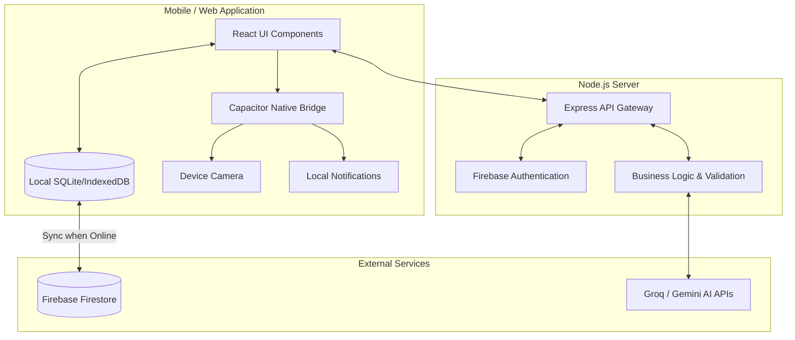
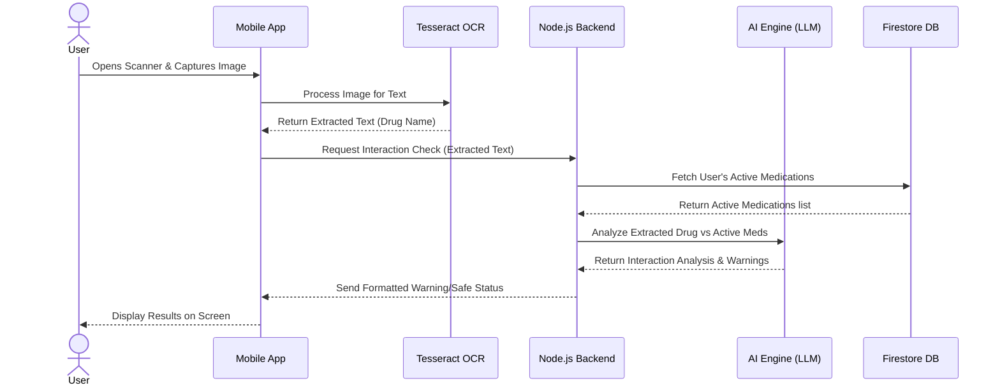
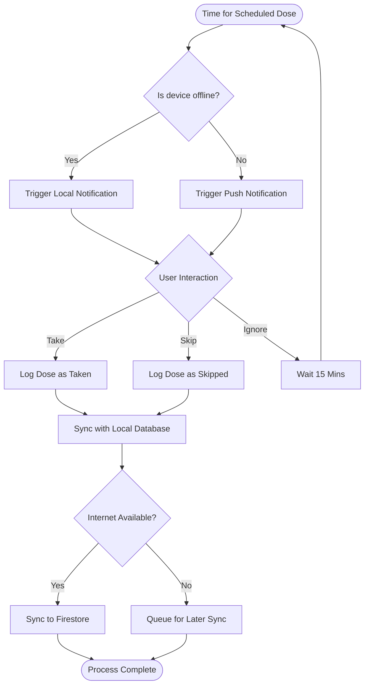
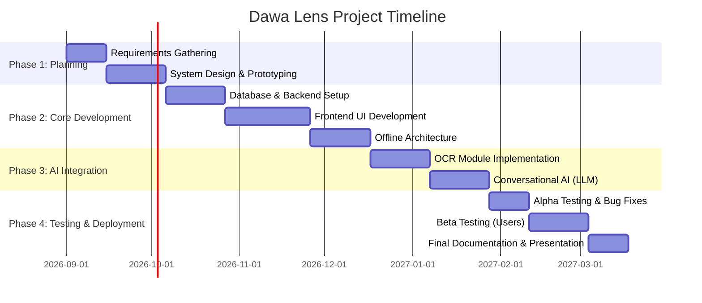

# Project Proposal: Dawa Lens - Intelligence-Driven Medication Safety and Management Ecosystem

## 1. Introduction and Background

In Uganda and across the broader East African region, healthcare delivery often relies on fragmented systems, especially concerning outpatient care and medication management. Patients frequently source medications from diverse outlets, including public hospitals, private clinics, and local community pharmacies. However, centralized patient record-keeping is virtually non-existent for the average citizen. As a result, the responsibility of managing complex medication regimens, understanding potential side effects, and avoiding adverse drug interactions falls almost entirely on the patients and their immediate caregivers. 

With the rapid adoption of smartphones in East Africa, there is a significant opportunity to leverage mobile technology and Artificial Intelligence (AI) to bridge this gap, providing accessible, intelligent, and localized healthcare support directly to the patient's pocket.

## 2. Motivation

The motivation for this project stems from the alarming rate of preventable medication errors, adverse drug reactions, and treatment non-adherence in Uganda. Factors such as low health literacy, complex multi-drug regimens for chronic illnesses, and language barriers significantly contribute to this crisis. Furthermore, the burden on caregivers managing medications for elderly relatives or children is immense. A technology-driven approach that localizes medication information, automates reminders, and uses AI to identify drugs and potential interactions can drastically improve health outcomes and reduce preventable hospital readmissions.

## 3. Problem Statement

Despite global advancements in digital health, patients in East Africa face profound challenges in managing their medications safely. The lack of unified medical records means healthcare providers often prescribe drugs without a complete picture of a patient's current medications, leading to dangerous drug-drug and drug-food interactions. Furthermore, identifying local generic drugs is difficult for the average patient, and existing medication reminder applications are designed for Western markets—they require constant high-speed internet, lack support for local languages like Swahili, and do not account for the localized brands of medication common in Uganda. There is an urgent need for an intelligent, offline-capable, and context-aware system to manage medication safely in this region.

## 4. Objectives

### Main Objective
To design and develop "Dawa Lens," an intelligent, cross-platform medication management ecosystem that utilizes artificial intelligence and computer vision to improve medication adherence and safety for patients in East Africa.

### Specific Objectives
1. To develop a computer vision module utilizing Optical Character Recognition (OCR) to identify and verify medications directly from local packaging and pill bottles.
2. To build a context-aware conversational AI assistant capable of providing localized medication guidance, answering health queries, and warning about potential drug interactions.
3. To implement an offline-first mobile architecture capable of functioning seamlessly in areas with intermittent or no internet connectivity, synchronizing data locally.
4. To design a Family Hub feature that allows caregivers to securely monitor and manage the medication schedules of their dependents.

## 5. Justification and Significance of the Study

This project is highly significant as it directly addresses a critical gap in the East African healthcare ecosystem. By empowering patients with a tool that not only reminds them to take their medication but also acts as an intelligent safety net against adverse interactions, Dawa Lens can significantly reduce medication-related morbidity. For the healthcare system, this translates to fewer preventable hospital visits. For the users, the inclusion of offline capabilities and family management features ensures that the solution is practical, inclusive, and tailored to the socio-cultural dynamics of Ugandan families.

## 6. Scope of the Project

The project will focus on the development of a cross-platform mobile application (for Android and iOS) and a supporting backend infrastructure. 
**In Scope:**
- Pill scanning and OCR identification.
- Conversational AI for medication information and interaction checking.
- Medication scheduling, adherence tracking, and wellness logging.
- Offline data persistence and cloud synchronization.
- Caregiver and family management portals.

**Out of Scope:**
- Direct integration with national hospital Electronic Health Record (EHR) systems.
- E-commerce functionality for purchasing or dispensing physical medications.
- Diagnostic features (the app will not diagnose illnesses).

## 7. Literature Review

Existing medication management solutions (such as Medisafe or MyTherapy) have seen significant success globally but struggle with adoption in East Africa. Literature indicates that these tools often fail in developing regions due to three main factors: reliance on continuous internet connectivity, databases tailored to Western drug brands, and a lack of localization. 

Recent advancements in edge computing and mobile AI have made it possible to run sophisticated OCR and lightweight machine learning models directly on mobile devices. Studies show that combining OCR with Large Language Models (LLMs) can significantly improve the accuracy of medical text interpretation. By leveraging these modern frameworks, Dawa Lens proposes to solve the shortcomings of existing apps by ensuring offline functionality and utilizing AI trained to recognize context-specific medical queries.

## 8. Methodology

The project will be developed using the Agile Software Development Life Cycle (SDLC), allowing for iterative development, continuous testing, and rapid adaptation to requirements.

- **Frontend Development:** Built using React 18 and Vite, wrapped in Capacitor to deploy as native Android and iOS applications from a single codebase.
- **Backend Services:** A Node.js and Express server will handle complex API routing, authentication, and secure data validation.
- **Database:** Firebase Firestore will be utilized for its robust offline-first capabilities and real-time NoSQL data synchronization.
- **AI and Computer Vision:** Tesseract.js will be used for on-device OCR pill scanning. Cloud-based LLMs (such as Groq/Llama or Google Gemini) will power the conversational assistant and drug interaction analysis.

## 9. System Design and Diagrams

### 9.1 Architectural Diagram
The system architecture follows a modern client-server model with an emphasis on offline-first edge capabilities.



### 9.2 Use Case Diagram
This diagram illustrates the interactions between the primary actors (Patient, Caregiver) and the system.

```mermaid
usecase
    actor Patient
    actor Caregiver
    
    package "Dawa Lens System" {
        usecase "Scan Medication" as UC1
        usecase "Log Dose" as UC2
        usecase "Chat with AI" as UC3
        usecase "View Wellness Trends" as UC4
        usecase "Manage Dependent's Meds" as UC5
        usecase "Receive Reminders" as UC6
    }
    
    Patient --> UC1
    Patient --> UC2
    Patient --> UC3
    Patient --> UC4
    Patient --> UC6
    
    Caregiver --> UC5
    Caregiver --> UC4
    Caregiver --> UC6
```

### 9.3 Sequence Diagram
This sequence diagram details the process of a user scanning a medication package to check for potential drug interactions.



### 9.4 Activity Diagram
This diagram outlines the activity flow for the automated medication reminder system.



## 10. Risk Management

| Risk Identification | Probability | Impact | Mitigation Strategy |
| :--- | :---: | :---: | :--- |
| **OCR Inaccuracy on local packaging** | High | High | Implement user-confirmation steps after scanning. Train/fine-tune OCR for common local fonts and provide manual entry fallbacks. |
| **API Rate Limits / High Costs for AI** | Medium | Medium | Implement aggressive caching of common queries. Use lightweight, open-source models (like Llama via Groq) to reduce token costs. |
| **Extended Internet Outages** | High | High | Strict adherence to an offline-first architecture. Ensure all critical paths (reminders, viewing current meds) work entirely without internet. |
| **Data Privacy Breaches** | Low | Critical | Utilize Firebase robust security rules to isolate user data. Ensure PII (Personally Identifiable Information) is stripped before sending data to third-party AI APIs. |

## 11. Work Plan and Time Schedule

The project is estimated to take approximately 7 months to complete, divided into specific phases.



## 12. Detailed Budget

*Note: All costs are estimated based on a 6-8 month development and pilot testing cycle.*

| Category | Item Description | Estimated Cost (UGX) | Estimated Cost (USD) |
| :--- | :--- | :--- | :--- |
| **Hardware** | Development Laptop & Testing Devices (Android/iOS) | *Existing/Provided* | $0 |
| **Cloud Infrastructure**| Firebase Blaze Plan (Hosting, Firestore reads/writes) | 185,000 UGX | ~$50 |
| **AI API Services** | Groq / Gemini API Token usage (for development & testing) | 110,000 UGX | ~$30 |
| **Software Licenses** | Apple Developer Account (if deploying to iOS TestFlight) | 370,000 UGX | $99 |
| **Miscellaneous** | Internet Data & Contingency | 185,000 UGX | ~$50 |
| **Total Estimated Budget** | | **850,000 UGX** | **~$229** |

## 13. Expected Outcomes

Upon completion, this project will deliver a fully functional, cross-platform mobile application prototype. The expected outcomes include:
1. A reliable, offline-capable medication reminder and logging system.
2. A demonstrated ability to scan and identify local medication packaging using on-device OCR.
3. An operational AI assistant that successfully provides context-aware drug interaction warnings.
4. A functional Family Hub portal for caregiver management.
5. A comprehensive project report and documentation detailing the system architecture, code implementation, and testing results.

## 14. References

1. World Health Organization (WHO). (2022). *Medication Without Harm*. 
2. Ministry of Health, Republic of Uganda. (2023). *Annual Health Sector Performance Report*.
3. Meta. (2024). *Llama 3 Documentation*.
4. Capacitor by Ionic. (2024). *Cross-platform Native runtime documentation*.
5. Google Firebase. (2024). *Firestore Offline Data Synchronization*.
