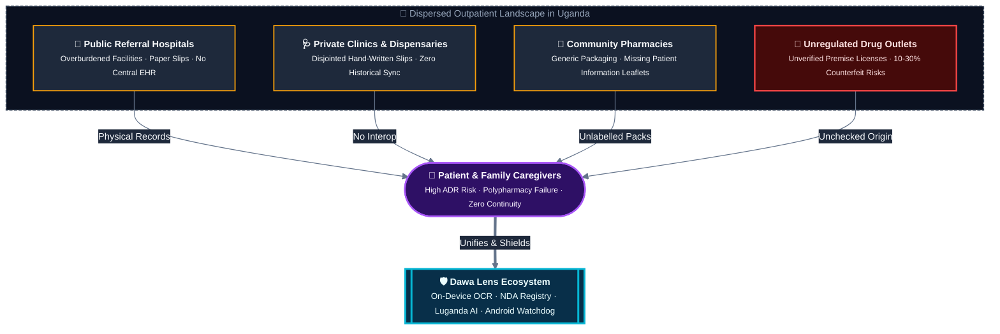
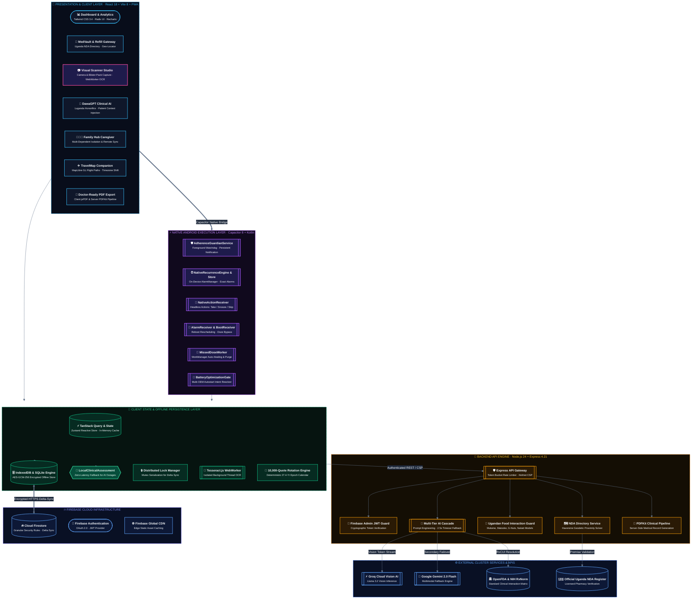
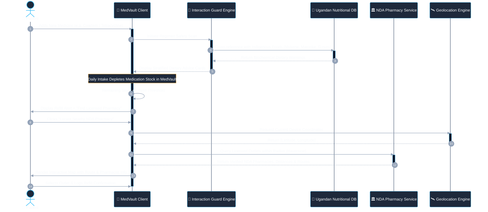
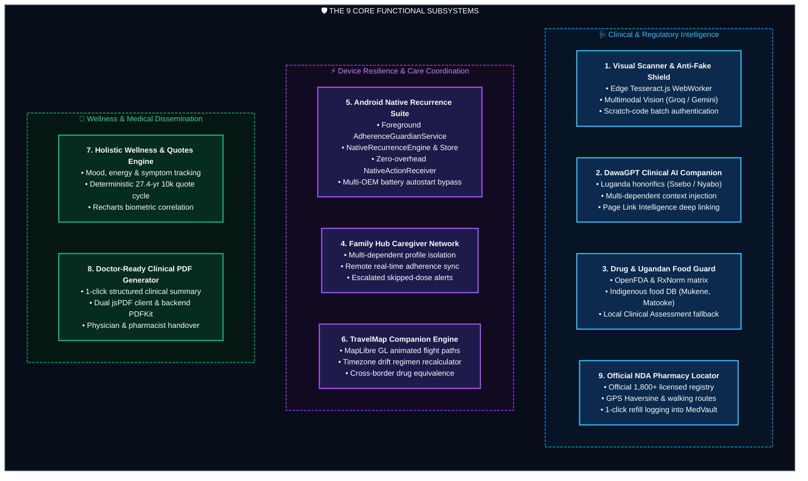
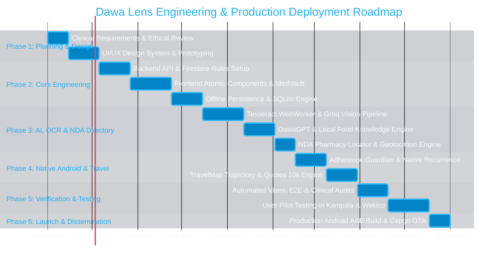

# Project Proposal: Dawa Lens — Intelligence-Driven Medication Safety, Adherence, and Family Care Ecosystem

---

## 1. Executive Summary

The proposed project, entitled **Dawa Lens**, designs, architects, and deploys an intelligent, offline-first medication safety, adherence, and caregiving ecosystem engineered specifically to address the structural healthcare challenges in Uganda. By harmonizing high-performance mobile edge computing, on-device optical character recognition (OCR), multimodal artificial intelligence, localized pharmacological intelligence, and an official directory of licensed community pharmacies, Dawa Lens transforms any standard smartphone into a context-aware personal clinical companion.

The platform directly eliminates preventable medication errors, bridges severe health literacy divides, validates licensed pharmaceutical outlets via the National Drug Authority (NDA) Uganda register, and safeguards patients against hazardous drug-drug and drug-food interactions involving indigenous Ugandan diets (*Matooke*, *Mukene*, *G-nut sauce*, *Nakati*). Furthermore, through an integrated Family Hub and an Android-native adherence defense layer, Dawa Lens provides multi-generational families and caregivers with real-time, synchronized oversight of vulnerable dependents. Built on an offline-first architectural paradigm utilizing React 18, Vite 8, Capacitor 8 with custom native Kotlin background services (**`AdherenceGuardianService`**, **`NativeRecurrenceEngine`**), Node.js 24, and Firebase Cloud Firestore, Dawa Lens delivers sub-second clinical guidance and deterministic alarm delivery even in environments characterized by complete network outages, aggressive operating system battery killers, and entry-tier smartphone hardware.

---

## 2. Introduction, Background & Healthcare Context in Uganda

Across Uganda, healthcare delivery continues to experience structural fragmentation, particularly within outpatient clinical management, chronic disease care, and pharmaceutical distribution. The prevailing healthcare model requires citizens to navigate a dispersed continuum of public health centers, private clinics, community pharmacies, and informal drug dispensaries. Because centralized Electronic Health Record (EHR) systems remain non-existent for the vast majority of the population, longitudinal medical histories and active medication profiles reside exclusively in the physical possession of patients or their immediate family members.



Consequently, the burden of managing multi-drug regimens, identifying unlabelled generic packaging, recognizing contraindications, verifying pharmacy legitimacy, and adhering strictly to complex dosing schedules falls entirely upon patients and domestic caregivers. This dynamic is exacerbated by five critical socio-technical factors:

1. **Polypharmacy in Multi-Morbidity Management**: Chronic conditions such as hypertension, diabetes, and cardiovascular diseases frequently co-occur with infectious diseases including HIV/AIDS, malaria, and tuberculosis. Patients are routinely prescribed complex combinations of antiretrovirals (ARVs), Artemisinin-based Combination Therapies (ACTs), antihypertensives, and antibiotics, dramatically elevating the risk of adverse drug reactions (ADRs).
2. **Profligacy of Generic Packaging and Unregulated Outlets**: Pharmacies frequently dispense generic formulations in plain blister strips or unlabelled envelopes without accompanying patient information leaflets (PILs). Patients unable to decipher pharmaceutical nomenclature frequently take incorrect dosages or discontinue therapy prematurely. Furthermore, outpatient consumers lack readily accessible tools to confirm whether local dispensing premises hold authentic operating licenses from the National Drug Authority (NDA).
3. **Localized Dietary Interactions**: Standard clinical databases evaluate drug interactions exclusively against Western dietary staples, ignoring indigenous Ugandan foods. Common local foods—such as steamed green bananas (*Matooke*), millet bread (*Kalo*), silver fish (*Mukene*), groundnut stew (*G-nut sauce*), grasshoppers (*Nsenene*), and indigenous greens (*Nakati*, *Dodo*)—contain biochemical properties that alter drug bioavailability, yet patients receive no systematic warnings regarding these food-drug interactions.
4. **Hardware and Infrastructure Constraints**: Mobile users across Uganda predominantly utilize entry-level to mid-tier Android smartphones produced by manufacturers (such as Transsion/Tecno/Infinix, Xiaomi, and Samsung) whose aggressive operating system battery-saving algorithms kill background tasks, rendering standard reminder alarms non-functional. Furthermore, frequent network blackouts and high mobile data costs make cloud-dependent applications impractical.
5. **Language & Cultural Barriers in Digital Health**: Generic medical applications use technical clinical English that alienates local users. Bridging this gap requires conversational AI capable of contextualizing medical advice with regional cultural nuances and authentic Luganda honorific greetings (*Ssebo*, *Nyabo*).

With mobile phone penetration in Uganda exceeding 70% and rapid advancements in lightweight edge machine learning models, an unprecedented opportunity exists to build a localized, intelligent, and highly resilient mobile health platform. Dawa Lens directly addresses these systemic vulnerabilities.

---

## 3. Problem Statement & Motivation

Despite the proliferation of digital health applications globally, existing solutions fail to provide effective medication safety and adherence management within developing regions. Western-centric applications (such as Medisafe and MyTherapy) operate on assumptions of uninterrupted high-speed 4G/5G connectivity, comprehensive national drug registries (e.g., US NDC or UK BNF), high baseline health literacy, and Western dietary habits. When deployed within Uganda, these applications break down: they cannot recognize local generic brands, they fail to sound alarms when background processes are terminated by low-RAM Android skins, and they offer zero insight into local dietary contraindications.

Medication non-adherence and adverse drug events (ADEs) represent major drivers of preventable morbidity, mortality, antimicrobial resistance (AMR), and emergency hospital readmissions across Sub-Saharan Africa. Furthermore, multi-generational households place an unsustainable mental burden on primary caregivers who must coordinate the daily treatments of aging parents and young children without shared tools or verified access to licensed pharmacies.

The motivation behind Dawa Lens is to engineer an accessible, culturally competent, and technically robust clinical safety net. By providing on-device computer vision, context-aware artificial intelligence, localized nutritional knowledge, offline data persistence, an official NDA licensed pharmacy locator, and an OS-level Android adherence watchdog, Dawa Lens empowers every patient and caregiver with the expertise and vigilance of a dedicated personal pharmacist.

---

## 4. Project Aim and Specific Objectives

### 4.1 Primary Aim
The primary aim of this project is to design, develop, evaluate, and deploy **Dawa Lens** — an offline-first, intelligence-driven medication safety, adherence tracking, and family caregiving ecosystem tailored to the clinical, linguistic, regulatory, and infrastructural realities of Uganda.

### 4.2 Specific Objectives
To achieve this primary aim, the project executes the following specific engineering and research objectives:

1. **Develop an Edge-Optimized Computer Vision & OCR Module**: Implement a dual-tier medication recognition pipeline utilizing client-side Tesseract.js in dedicated Web Workers for instant text extraction, paired with cloud multimodal Vision LLMs (Groq Llama 3.2 Vision and Google Gemini 2.0 Flash) to identify pills, blister strips, and handwritten prescription slips, complemented by simulated scratch-code authentication.
2. **Build DawaGPT — A Context-Aware Clinical Conversational Agent**: Construct an empathetic, multi-turn AI assistant capable of translating complex medical leaflets into plain, culturally tailored language, resolving authentic Luganda honorifics (*Ssebo*, *Nyabo*), injecting multi-dependent Family Hub clinical records, and executing in-app deep link recommendations via Page Link Intelligence.
3. **Formulate a Ugandan Drug & Local Food Interaction Guard**: Develop an intelligent cross-referencing engine combining international clinical databases (OpenFDA, RxNorm concept resolution) with a specialized Ugandan Nutritional Knowledge Base to proactively detect dangerous drug-drug combinations and dietary contraindications (*Mukene* with Tetracyclines, *Nakati* with Warfarin, *G-nut sauce* with *Coartem*).
4. **Engineer an Offline-First Persistence & Sync Architecture**: Implement a robust client-side storage architecture utilizing IndexedDB, native SQLite plugins, TanStack Query, Firestore memory caching, and a distributed locking manager to ensure zero-latency read/write access during complete internet outages, with race-condition-free background delta-synchronization upon network restoration.
5. **Implement an Android Native Recurrence Engine & Adherence Guardian Service**: Build a native Android Kotlin execution layer comprising `NativeRecurrenceEngine`, persistent `NativeRecurrenceStore`, `AdherenceGuardianService` (Foreground Service with persistent notification channel), and `NativeActionReceiver` for zero-overhead background alarm actions (Take, Snooze, Skip), combined with multi-OEM battery optimization intent resolution.
6. **Construct a Collaborative Family Hub & Caregiver Network**: Provide a secure multi-profile management framework enabling caregivers to remotely monitor medication adherence, verify dose logs, consult DawaGPT within specific dependent contexts, and receive instant alerts regarding skipped critical doses for elderly relatives or pediatric dependents.
7. **Develop an Adaptive Travel Companion Engine with Trajectory Mapping**: Integrate an interactive MapLibre GL `TravelMap` with animated flight trajectories and an automated timezone recalculation algorithm with cross-border medication equivalence mapping, preventing accidental double-dosing or missed therapeutic windows.
8. **Create a Holistic Wellness Journal & 10,000-Quote Engagement Affirmations Engine**: Incorporate daily biometric, symptom, and mood logging with interactive Recharts visualizations, doctor-ready PDF exports (PDFKit/jsPDF), and a deterministic 27.4-year calendar-day rotation engine providing 10,000 unique motivational, health, and adherence quotes across dedicated system notification channels.
9. **Integrate an Official National Drug Authority (NDA) Uganda Pharmacy Locator**: Embed the official NDA Uganda licensed pharmacy register directly into the medication inventory (`MedVault`), providing patients with real-time GPS proximity matching, turn-by-turn road route approximations, premise numbers, supervising pharmacist credentials, and 1-click refill logging.

---

## 5. Justification and Significance of the Study

The development of Dawa Lens holds profound clinical, socio-economic, and technological significance:

* **Clinical Impact & Patient Safety**: By warning patients of adverse drug interactions and contraindications before ingestion, Dawa Lens directly prevents toxic drug combinations, mitigates drug-induced organ damage, and curtails the emergence of drug-resistant pathogens caused by erratic dosing.
* **Reduction of Healthcare Costs**: Preventable adverse drug events and treatment failures place an immense financial strain on both households and public health facilities. By enhancing adherence and preventing acute complications, Dawa Lens reduces emergency room visits and hospital readmissions.
* **Official Regulatory Alignment**: Integrating the National Drug Authority (NDA) licensed pharmacy register directly connects patients to authentic, inspected community drug outlets, combating the infiltration of substandard and counterfeit medicines.
* **Caregiver Empowerment & Family Inclusion**: In the Ugandan cultural context, family units provide the primary healthcare safety net. The Family Hub feature formalizes and simplifies this caregiving structure, allowing remote family members to support aging parents and children transparently.
* **Technological Innovation for Emerging Markets**: Dawa Lens serves as an architectural benchmark for building high-performance, AI-augmented health applications that operate seamlessly under severe infrastructural constraints (low-end hardware, limited bandwidth, intermittent power, and aggressive Android OS process termination).

---

## 6. Project Scope

```mermaid
%%{init: {
  'theme': 'base',
  'themeVariables': {
    'primaryColor': '#1e293b',
    'primaryTextColor': '#f8fafc',
    'primaryBorderColor': '#38bdf8',
    'lineColor': '#64748b',
    'secondaryColor': '#0f172a',
    'tertiaryColor': '#1e1b4b',
    'clusterBkg': '#0b1120',
    'clusterBorder': '#334155',
    'edgeLabelBackground': '#1e293b',
    'fontFamily': 'Geist, Inter, system-ui, -apple-system, sans-serif',
    'fontSize': '12px'
  }
}}%%
flowchart LR
    subgraph InScope ["✅ IN SCOPE — Core Production Deliverables"]
        direction TB
        S1["📱 <b>Native Android App & PWA</b><br/><span style='font-size:10px;color:#6ee7b7'>Capacitor 8 · Production APK/AAB · Responsive</span>"]:::scopeItem
        S2["⚡ <b>Kotlin Adherence Core</b><br/><span style='font-size:10px;color:#6ee7b7'>AdherenceGuardianService & NativeRecurrenceEngine</span>"]:::scopeItem
        S3["🏥 <b>Official NDA Uganda Directory</b><br/><span style='font-size:10px;color:#6ee7b7'>1,800+ Licensed Outlets · Haversine Proximity</span>"]:::scopeItem
        S4["📷 <b>Dual-Engine Vision Studio</b><br/><span style='font-size:10px;color:#6ee7b7'>On-Device Tesseract.js & Cloud Multimodal AI</span>"]:::scopeItem
        S5["🤖 <b>DawaGPT Clinical Assistant</b><br/><span style='font-size:10px;color:#6ee7b7'>Luganda Honorifics · In-App Deep Linking</span>"]:::scopeItem
        S6["🥗 <b>Ugandan Food Interaction Guard</b><br/><span style='font-size:10px;color:#6ee7b7'>Mukene, Matooke, G-Nuts, Nakati Bio-Scans</span>"]:::scopeItem
        S7["💾 <b>Offline-First Resilience</b><br/><span style='font-size:10px;color:#6ee7b7'>Encrypted IndexedDB · SQLite · TanStack Sync</span>"]:::scopeItem
        S8["✈️ <b>TravelMap Companion</b><br/><span style='font-size:10px;color:#6ee7b7'>MapLibre GL · Flight Paths & Timezone Shifting</span>"]:::scopeItem
        S9["👥 <b>Family Hub Caregiver Network</b><br/><span style='font-size:10px;color:#6ee7b7'>Multi-Dependent Isolation · Escalate Missed Doses</span>"]:::scopeItem
        S10["📄 <b>Doctor-Ready Clinical PDF</b><br/><span style='font-size:10px;color:#6ee7b7'>Client jsPDF & Server PDFKit Engine</span>"]:::scopeItem
    end

    subgraph OutScope ["⛔ OUT OF SCOPE — Explicit Boundaries"]
        direction TB
        E1["❌ <b>Direct Hospital EHR Integration</b><br/><span style='font-size:10px;color:#fca5a5'>No Public FHIR/HL7 Hospital APIs in Uganda</span>"]:::outItem
        E2["❌ <b>In-App Drug E-Commerce</b><br/><span style='font-size:10px;color:#fca5a5'>Strictly Verification & Routing; No Settlement</span>"]:::outItem
        E3["❌ <b>Autonomous Medical Diagnosis</b><br/><span style='font-size:10px;color:#fca5a5'>Strictly Educational & Clinical Safety Advisory</span>"]:::outItem
        E4["❌ <b>Native iOS App Store Distribution</b><br/><span style='font-size:10px;color:#fca5a5'>100% Engineering Focused on Android Dominance</span>"]:::outItem
    end

    classDef scopeItem fill:#062b21,stroke:#10b981,stroke-width:1.5px,color:#f8fafc;
    classDef outItem fill:#3b0712,stroke:#f43f5e,stroke-width:1.5px,color:#f8fafc;
    style InScope fill:#041a14,stroke:#059669,stroke-width:1.8px,color:#34d399;
    style OutScope fill:#1c050a,stroke:#e11d48,stroke-width:1.8px,color:#fb7185;
```



### 6.1 Functional Scope
The platform encompasses a complete mobile client and cloud backend supporting user authentication, medication inventory management (*MedVault*), intelligent reminder scheduling, computer vision scanning, conversational clinical assistance, family multi-profile delegation, wellness logging, PDF medical export, and NDA pharmacy navigation.

### 6.2 Target Audience & Geographic Scope
The target deployment is strictly focused on urban, peri-urban, and rural populations across Uganda (Kampala, Wakiso, Mbarara, Gulu, Jinja, Mbale), localized for English and Luganda, with core system integrations (such as the National Drug Authority register) dedicated exclusively to the Ugandan regulatory, pharmaceutical, and healthcare context.

### 6.3 Delimitations & Strategic Focus
* **No Direct EHR Integration**: Due to the absence of standardized, public FHIR/HL7 APIs in regional hospitals, direct two-way hospital EHR synchronization is not included in this phase.
* **No Direct Pharmaceutical E-Commerce**: Dawa Lens strictly remains a safety, adherence, verification, and educational tool; it does not process financial transactions for drug purchases or operate as a commercial dispensary.
* **Strategic Android Prioritization**: iOS deployment was intentionally de-scoped to focus 100% of engineering bandwidth on deep native Android system integration (Foreground Services, AlarmManager, WorkManager, native autostart intent resolution) tailored to low-RAM devices dominating the African market.

---

## 7. Literature Review & Theoretical Foundations

### 7.1 Medication Adherence in Sub-Saharan Africa
Adherence to long-term therapies for chronic illnesses in developing countries averages only 50%, with lower rates reported across Sub-Saharan Africa (World Health Organization, 2022). Contributing factors include lack of patient education, complex polypharmacy regimens, absence of structured reminder mechanisms, and cultural misconceptions regarding pharmaceuticals. Studies indicate that automated mobile health (mHealth) interventions significantly improve clinical biomarkers (e.g., viral suppression in HIV, HbA1c control in diabetes, and blood pressure normalization in cardiovascular patients).

### 7.2 Computer Vision and Multimodal Edge Computing
Traditional OCR solutions often require clean, high-contrast flat documents, performing poorly on curved pill bottles, reflective blister foils, and crumpled prescription slips. Lightweight neural OCR (such as WebAssembly-compiled Tesseract.js) combined with large multimodal vision models (e.g., Meta Llama 3.2 Vision, Google Gemini 2.0 Flash) allows applications to extract structured entities (Drug Name, Strength, Dosage, Frequency, Expiry Date) directly from low-quality mobile camera frames. Processing initial OCR passes directly on-device substantially reduces cloud API costs and latency.

### 7.3 Large Language Models in Clinical Decision Support & Cultural Localization
While commercial LLMs exhibit impressive medical knowledge, unconstrained generative models pose risks of clinical hallucinations. Best practices in medical AI engineering mandate structured retrieval-augmented generation (RAG), strict system prompt boundaries, zero-shot entity validation against authoritative sources (RxNorm, OpenFDA), and deterministic safety filters. Furthermore, linguistic adaptations—such as injecting culturally authentic Luganda honorifics (*Ssebo*, *Nyabo*)—significantly improve user trust and adherence among Ugandan patients.

### 7.4 Offline-First Computing & Distributed State Synchronization
Offline-first software engineering shifts the primary source of truth from remote servers to the local client runtime. Utilizing IndexedDB, native SQLite, and local document caches alongside optimistic UI updates ensures instantaneous application responsiveness regardless of network availability. When connectivity is restored, idempotent synchronization protocols backed by distributed locking resolve conflicts and ensure global consistency without data loss.

### 7.5 Operating System Background Throttling & Foreground Service Mechanics
Modern Android operating systems enforce aggressive power-saving protocols (Doze mode, App Standby buckets, and proprietary OEM background killers such as Transsion HiOS, Xiaomi MIUI, and Samsung OneUI). To guarantee exact alarm delivery, standard web-layer notifications are insufficient. Implementing an Android Foreground Service (`AdherenceGuardianService`) paired with `AlarmManager.setExactAndAllowWhileIdle()` and native WorkManager recovery mechanisms is essential to prevent silent alarm failure.

---

## 8. Comprehensive System Architecture & Engineering Methodology

Dawa Lens is engineered using an **Agile Software Development Lifecycle (SDLC)** with two-week iterative sprints, automated continuous integration/continuous deployment (CI/CD) pipelines, and rigorous test-driven development.



### 8.1 Frontend Client Tier
* **Framework**: React 18.3 with TypeScript 5.8, utilizing strict typing across all data interfaces.
* **Build Tooling & Bundler**: Vite 8.0 with SWC compiler, tree-shaking, dynamic route-based code splitting, and Web Worker offloading.
* **Design & Styling**: Tailwind CSS 3.4, Radix UI accessible primitives, Framer Motion transitions, Lucide icons, Rive animations, and full Dark/Light adaptive themes.
* **Native Mobile Bridge**: Capacitor 8.0 with deep Android Kotlin extensions for hardware access (Camera, Location, Haptics, Local Preferences, Network Status).

### 8.2 Native Android Execution Tier
* **Adherence Guardian**: `AdherenceGuardianService.kt` running as a foreground service to maintain watchdog timers and prevent silent background termination.
* **Recurrence Engine**: `NativeRecurrenceEngine.kt` and `NativeRecurrenceStore.kt` executing on-device recurring interval calculations independent of webview states.
* **Background Actions**: `NativeActionReceiver.kt` intercepting user actions directly from notifications without launching the user interface.
* **Persistence & Recovery**: `BootReceiver.kt` and `MissedDoseWorker.kt` (Android WorkManager) guaranteeing alarm survival across device reboots and auto-healing missed dose schedules.

### 8.3 Client State & Offline Synchronization Tier
* **Data Fetching & Cache Management**: TanStack Query v5 with optimistic updates, IndexedDB query caching, and Firestore memory caching.
* **Concurrency Protection**: In-house Distributed Lock Manager preventing race conditions during simultaneous background delta synchronizations.
* **Background Workers**: `ocrWorker.ts` offloading Tesseract.js image binarization and OCR processing from the UI thread.
* **Engagement Engine**: `quotesService.ts` executing deterministic calendar-day rotations of 10,000 inspirational and health quotes.

### 8.4 Backend Services & API Gateway Tier
* **Runtime**: Node.js 24 (LTS) running Express 4.21.
* **Security & Middleware**: Firebase Admin SDK for cryptographic JWT token verification, Helmet HTTP headers (CSP, HSTS), Android Network Security Configuration, and Token Bucket rate limiters with response caching.
* **External Integration Pipeline**: Resilience-wrapped HTTP clients for Groq Llama 3.3/3.2, Google Gemini 2.0 Flash, OpenFDA endpoints, NIH RxNorm concept resolver, and the Uganda NDA Pharmacy register.
* **Reporting Engine**: Backend PDFKit paired with client-side `jspdf` for dual-mode clinical PDF generation.

---

## 9. Database Architecture & Data Models

The system utilizes **Firebase Cloud Firestore** structured with document-level isolation, parent-child subcollections, memory caching, and strict security rules ensuring that users and caregivers can only access authorized clinical records.

```
firestore-root/
│
├── users/{userId}/
│   ├── email: string
│   ├── displayName: string
│   ├── phoneNumber: string
│   ├── timezone: string (e.g. "Africa/Kampala")
│   ├── preferredLanguage: "en" | "sw" | "lg"
│   ├── gender: "male" | "female" | "other" (for Luganda honorific resolution)
│   ├── isCaregiver: boolean
│   ├── createdAt: timestamp
│   └── settings: { notificationSound: string, haptics: boolean, theme: string }
│
├── patients/{patientId}/
│   ├── caregiverId: string (Foreign Key -> users.userId)
│   ├── name: string
│   ├── relationship: "Self" | "Parent" | "Child" | "Spouse" | "Dependent"
│   ├── dateOfBirth: string
│   ├── bloodGroup: string
│   ├── allergies: Array<string>
│   ├── emergencyContact: { name: string, phone: string, relationship: string }
│   └── createdAt: timestamp
│
├── medicines/{medicineId}/
│   ├── userId: string (Owner ID)
│   ├── patientId: string (Target Individual ID)
│   ├── name: string (Brand Name, e.g. "Coartem")
│   ├── genericName: string (e.g. "Artemether/Lumefantrine")
│   ├── strength: string (e.g. "20/120mg")
│   ├── form: "tablet" | "capsule" | "syrup" | "injection" | "inhaler" | "drops"
│   ├── instructions: string (e.g. "Take with fatty food/milk")
│   ├── foodRequirements: "with_food" | "before_food" | "after_food" | "empty_stomach"
│   ├── totalStock: number
│   ├── remainingStock: number
│   ├── refillThreshold: number
│   ├── frequencyPerDay: number
│   ├── expiryDate: string
│   ├── interactions: Array<{ drug: string, severity: "mild"|"moderate"|"severe", description: string }>
│   └── createdAt: timestamp
│
├── reminders/{reminderId}/
│   ├── userId: string
│   ├── patientId: string
│   ├── medicineId: string
│   ├── medicineName: string
│   ├── timeSlots: Array<string> (e.g. ["08:00", "14:00", "20:00"])
│   ├── daysOfWeek: Array<number> (0 = Sunday, 1 = Monday ... 6 = Saturday)
│   ├── dosageQuantity: string (e.g. "1 Tablet")
│   ├── startDate: string
│   ├── endDate: string
│   ├── intervalHours: number (e.g. 8 for interval dosing)
│   ├── isActive: boolean
│   └── createdAt: timestamp
│
├── doseLogs/{doseLogId}/
│   ├── userId: string
│   ├── patientId: string
│   ├── reminderId: string
│   ├── medicineId: string
│   ├── medicineName: string
│   ├── scheduledTime: timestamp
│   ├── loggedTime: timestamp
│   ├── status: "taken" | "skipped" | "delayed"
│   ├── reasonSkipped: string (optional)
│   └── notes: string
│
├── wellnessLogs/{wellnessLogId}/
│   ├── userId: string
│   ├── patientId: string
│   ├── date: string (YYYY-MM-DD)
│   ├── mood: number (1 to 5 scale)
│   ├── energy: number (1 to 5 scale)
│   ├── sleepHours: number
│   ├── symptoms: Array<string> (e.g. ["Nausea", "Headache", "Dizziness"])
│   ├── severityScore: number
│   ├── notes: string
│   └── timestamp: timestamp
│
└── ndaPharmacies (Local Indexed Register):
    ├── id: string
    ├── name: string
    ├── premiseNo: string
    ├── premiseType: "Retail" | "Wholesale"
    ├── pharmacist: string
    ├── psuNo: string
    ├── district: string
    ├── region: string
    ├── latitude: number
    ├── longitude: number
    └── phone: string
```

---

## 10. Detailed System Design & Visual Diagrams

### 10.1 Multi-Actor System Process Flowchart
The process flowchart delineates the primary workflows connecting Patients, Domestic Caregivers, and Healthcare Providers with the core platform services.

```mermaid
%%{init: {
  'theme': 'base',
  'themeVariables': {
    'primaryColor': '#1e293b',
    'primaryTextColor': '#f8fafc',
    'primaryBorderColor': '#38bdf8',
    'lineColor': '#64748b',
    'secondaryColor': '#0f172a',
    'tertiaryColor': '#1e1b4b',
    'clusterBkg': '#0b1120',
    'clusterBorder': '#334155',
    'edgeLabelBackground': '#1e293b',
    'fontFamily': 'Geist, Inter, system-ui, -apple-system, sans-serif',
    'fontSize': '12px'
  }
}}%%
flowchart TD
    %% Primary Actors
    subgraph Actors ["👥 PRIMARY SYSTEM ACTORS"]
        Patient(["<b>👤 Patient</b><br/><span style='font-size:10px;color:#38bdf8'>Primary Care Recipient · Self-Management</span>"]):::actorNode
        Caregiver(["<b>👨‍👩‍👧 Family Caregiver</b><br/><span style='font-size:10px;color:#38bdf8'>Remote Adherence Oversight · Escalations</span>"]):::actorNode
        Clinician(["<b>🩺 Clinician / Pharmacist</b><br/><span style='font-size:10px;color:#38bdf8'>Consultation · Review Clinical Records</span>"]):::actorNode
    end

    %% Client Workflows
    subgraph AppWorkflows ["📱 DAWA LENS CLIENT CAPABILITIES"]
        ScanAct["<b>📷 Scan Packaging & Anti-Fake Shield</b><br/><span style='font-size:10px;color:#94a3b8'>Blister Pack Vision & Scratch Codes</span>"]:::workflowNode
        ChatAct["<b>💬 Consult DawaGPT Assistant</b><br/><span style='font-size:10px;color:#94a3b8'>Luganda Honorifics · Plain Language Guidance</span>"]:::workflowNode
        GuardAct["<b>🥗 Ugandan Food & Drug Safety Scan</b><br/><span style='font-size:10px;color:#94a3b8'>Screen Mukene, Matooke, G-Nut Conflicts</span>"]:::workflowNode
        DoseAct["<b>💊 MedVault Management & Dose Logging</b><br/><span style='font-size:10px;color:#94a3b8'>Confirm Intake, Snooze, or Skip</span>"]:::workflowNode
        PharmAct["<b>🏥 NDA Pharmacy Locator & Routes</b><br/><span style='font-size:10px;color:#94a3b8'>GPS Distance & Walking Directions</span>"]:::workflowNode
        AlarmAct["<b>🔔 Native Foreground Alarms</b><br/><span style='font-size:10px;color:#94a3b8'>Doze Bypass · Headless Notifications</span>"]:::workflowNode
        FamilyAct["<b>👨‍👩‍👧 Family Hub Dependent Oversight</b><br/><span style='font-size:10px;color:#94a3b8'>Cross-Profile Adherence Telemetry</span>"]:::workflowNode
        TravelAct["<b>✈️ TravelMap Companion Regimens</b><br/><span style='font-size:10px;color:#94a3b8'>Trans-Meridian Interval Adjuster</span>"]:::workflowNode
        ReportAct["<b>📄 Doctor-Ready Clinical PDF Export</b><br/><span style='font-size:10px;color:#94a3b8'>Consultation Prep & Telemetry History</span>"]:::workflowNode
    end

    %% Underlying Engines
    subgraph ExecutionEngines ["⚙️ UNDERLYING EXECUTION ENGINES"]
        EngRecurrence[["<b>⚡ NativeRecurrenceEngine & Guardian</b><br/><span style='font-size:10px;color:#c084fc'>Kotlin Foreground Service · Exact Alarms</span>"]]:::engineNode
        EngNDA[("<b>🗺️ NDA Haversine Directory Engine</b><br/><span style='font-size:10px;color:#fbbf24'>1,800+ Geocoded Licensed Premise DB</span>")]:::engineNode
        EngAI[["<b>🧠 Groq & Gemini Vision AI Cascade</b><br/><span style='font-size:10px;color:#60a5fa'>Multimodal Entity Extraction (2.5s SLA)</span>"]]:::engineNode
        EngLocalAI{{"<b>🛡️ LocalClinicalAssessment Fallback</b><br/><span style='font-size:10px;color:#34d399'>Deterministic Rule Engine (Air-Gapped)</span>"}}:::engineNode
        EngSync[("<b>💾 Offline Storage & Firestore Sync</b><br/><span style='font-size:10px;color:#34d399'>IndexedDB / SQLite · Distributed Lock Mutex</span>")]:::engineNode
    end

    %% Classes
    classDef actorNode fill:#0c2a4d,stroke:#38bdf8,stroke-width:2px,color:#f8fafc;
    classDef workflowNode fill:#0f172a,stroke:#64748b,stroke-width:1.5px,color:#f8fafc;
    classDef engineNode fill:#1e1b4b,stroke:#a855f7,stroke-width:1.8px,color:#f8fafc;

    %% Subgraphs
    style Actors fill:#081329,stroke:#0284c7,stroke-width:1.5px,stroke-dasharray: 4 2,color:#38bdf8;
    style AppWorkflows fill:#0b1120,stroke:#475569,stroke-width:1.5px,stroke-dasharray: 4 2,color:#cbd5e1;
    style ExecutionEngines fill:#120c24,stroke:#7c3aed,stroke-width:1.5px,stroke-dasharray: 4 2,color:#c084fc;

    %% Actor Connections
    Patient --> ScanAct & ChatAct & GuardAct & DoseAct & PharmAct & TravelAct & ReportAct
    Caregiver --> FamilyAct & DoseAct & ReportAct
    Clinician -.->|Reviews Consultation Report| ReportAct

    %% Engine Bindings
    ScanAct --> EngAI
    ChatAct --> EngAI
    ScanAct -.->|Offline / Fallback| EngLocalAI
    AlarmAct --- EngRecurrence
    DoseAct --> EngRecurrence
    PharmAct --> EngNDA
    DoseAct --> EngSync
    GuardAct --> EngLocalAI
```



### 10.2 Multimodal Pill Scanning & AI Verification Sequence Diagram
This diagram illustrates the lifecycle of capturing medication packaging, executing edge OCR, performing cloud multimodal validation, checking interactions, and cataloging the drug into *MedVault*.

```mermaid
%%{init: {
  'theme': 'base',
  'themeVariables': {
    'actorBkg': '#1e293b',
    'actorBorder': '#38bdf8',
    'actorTextColor': '#f8fafc',
    'actorLineColor': '#64748b',
    'signalColor': '#94a3b8',
    'signalTextColor': '#f8fafc',
    'labelBoxBkgColor': '#0f172a',
    'labelBoxBorderColor': '#334155',
    'labelTextColor': '#f8fafc',
    'loopTextColor': '#f8fafc',
    'noteBorderColor': '#f59e0b',
    'noteBkgColor': '#1e293b',
    'noteTextColor': '#f8fafc',
    'activationBorderColor': '#38bdf8',
    'activationBkgColor': '#0f172a',
    'fontFamily': 'Geist, Inter, system-ui, sans-serif'
  }
}}%%
sequenceDiagram
    autonumber
    actor User as 👤 Patient / Caregiver
    participant UI as 📱 React Client View
    participant Worker as 📜 Tesseract OCR Worker
    participant LocalAI as 🔬 LocalClinicalAssessment
    participant Server as 🚀 Express API Gateway
    participant VisionAI as 🧠 Groq / Gemini AI
    participant FDA as 🏛️ OpenFDA / RxNorm
    participant Cache as 🗄️ IndexedDB / SQLite Store
    participant Cloud as 🔥 Cloud Firestore

    User->>UI: Captures Pill / Blister Pack Camera Frame
    activate UI
    UI->>Worker: Offload Image Buffer via WebWorker IPC
    activate Worker
    Worker-->>UI: Return Extracted Raw Text & Confidence Score
    deactivate Worker
    
    alt Offline Mode or API Timeout (>2.5s)
        UI->>LocalAI: Execute Local Clinical Rule Engine & Entity Regex
        activate LocalAI
        LocalAI-->>UI: Instant Extracted Formulation, Strength & Safety Advisory
        deactivate LocalAI
    else Online Multimodal Verification
        UI->>Server: POST /api/vision/analyze (Image + Raw OCR)
        activate Server
        Server->>VisionAI: Multimodal Inference (Name, Strength, Form, Expiry)
        activate VisionAI
        VisionAI-->>Server: Return Structured JSON Medication Monograph
        deactivate VisionAI
        Server->>FDA: Cross-reference Drug Name with RxNorm & OpenFDA
        activate FDA
        FDA-->>Server: Return Contraindications & Interaction Catalog
        deactivate FDA
        Server-->>UI: Return Verified Drug Profile & Food Interaction Matrix
        deactivate Server
    end

    opt Anti-Counterfeit Verification
        User->>UI: Inputs Packaging Scratch-Off Code
        UI->>Server: Verify Code against Simulated Batch Registry
        Server-->>UI: Authenticity Verified (Authentic vs Counterfeit Alert)
    end

    UI->>User: Display Verification Screen for One-Tap Confirmation
    User->>UI: Confirms & Saves Medication to MedVault
    UI->>Cache: Persist Locally (Immediate Offline Availability)
    Cache-->>Cloud: Enqueue Distributed Lock Delta-Sync upon Network
    deactivate UI

### 10.3 Native Recurrence Engine, Adherence Guardian & Battery Gate Activity Flow
This activity diagram demonstrates how Dawa Lens ensures reliable alarm delivery despite aggressive Android OS process termination, handles dose logging via background action receivers, and synchronizes data across network transitions.

```mermaid
%%{init: {
  'theme': 'base',
  'themeVariables': {
    'primaryColor': '#1e293b',
    'primaryTextColor': '#f8fafc',
    'primaryBorderColor': '#38bdf8',
    'lineColor': '#64748b',
    'secondaryColor': '#0f172a',
    'tertiaryColor': '#1e1b4b',
    'clusterBkg': '#0b1120',
    'clusterBorder': '#334155',
    'edgeLabelBackground': '#1e293b',
    'fontFamily': 'Geist, Inter, system-ui, -apple-system, sans-serif',
    'fontSize': '12px'
  }
}}%%
flowchart TD
    Start(["<b>⏰ Scheduled Dose Approaches</b><br/><span style='font-size:10px;color:#94a3b8'>Native Alarm Window Opens</span>"]):::stateNode --> GuardianCheck{"<b>🔍 Is Guardian Service Active?</b><br/><span style='font-size:10px;color:#94a3b8'>Foreground Watchdog Verification</span>"}:::decisionNode
    
    GuardianCheck -- "No" --> StartGuardian["<b>🛡️ Start AdherenceGuardianService</b><br/><span style='font-size:10px;color:#94a3b8'>Spawn Persistent Status Notification</span>"]:::actionNode
    StartGuardian --> BatteryCheck
    GuardianCheck -- "Yes" --> BatteryCheck{"<b>🔋 Is Battery Optimization Bypassed?</b><br/><span style='font-size:10px;color:#94a3b8'>OEM Autostart Intent Whitelist</span>"}:::decisionNode
    
    BatteryCheck -- "No" --> PromptGate["<b>⚠️ Display BatteryOptimizationGate</b><br/><span style='font-size:10px;color:#94a3b8'>Prompt Xiaomi / Samsung / Transsion Intent</span>"]:::alertNode
    PromptGate --> RequestPermission["<b>⚙️ Request Autostart Exemption</b><br/><span style='font-size:10px;color:#94a3b8'>Direct User to Settings Whitelist</span>"]:::actionNode
    RequestPermission --> ArmAlarm["<b>🎯 NativeRecurrenceEngine Arms Alarm</b><br/><span style='font-size:10px;color:#94a3b8'>AlarmManager.setExactAndAllowWhileIdle()</span>"]:::nativeNode
    BatteryCheck -- "Yes" --> ArmAlarm

    ArmAlarm --> AlarmTriggered(["<b>🔔 AlarmReceiver Fires at Exact Time</b><br/><span style='font-size:10px;color:#c084fc'>Full-Screen Intent / High-Priority Heads-Up</span>"]):::stateNode
    AlarmTriggered --> UserAction{"<b>👆 User Notification Action</b><br/><span style='font-size:10px;color:#94a3b8'>Headless Button Press</span>"}:::decisionNode

    UserAction -- "Take" --> ActionReceiver[["<b>⚡ NativeActionReceiver (Background)</b><br/><span style='font-size:10px;color:#34d399'>Executes Zero-Overhead Intake Log</span>"]]:::actionNode
    UserAction -- "Skip" --> ActionReceiver
    UserAction -- "Snooze" --> Reschedule["<b>⏱️ Reschedule Alarm +15 Mins</b><br/><span style='font-size:10px;color:#94a3b8'>Set Immediate Snooze Alarm</span>"]:::actionNode
    Reschedule --> ArmAlarm

    ActionReceiver --> DeductStock["<b>📦 Deduct MedVault Inventory Stock</b><br/><span style='font-size:10px;color:#94a3b8'>Update NativeRecurrenceStore</span>"]:::actionNode
    DeductStock --> WriteLocalDB[("<b>🗄️ Persist to IndexedDB / SQLite</b><br/><span style='font-size:10px;color:#34d399'>Local Commit (Zero Latency)</span>")]:::dbNode

    WriteLocalDB --> ConnectivityCheck{"<b>🌐 Is Network Online?</b><br/><span style='font-size:10px;color:#94a3b8'>Capacitor Network Plugin Status</span>"}:::decisionNode
    ConnectivityCheck -- "Yes" --> DistributedLock["<b>🔒 Acquire Distributed Sync Lock</b><br/><span style='font-size:10px;color:#94a3b8'>Mutex Serialization across Threads</span>"]:::actionNode
    DistributedLock --> PushFirestore[("<b>🔥 Push Delta-Sync to Firestore</b><br/><span style='font-size:10px;color:#818cf8'>Multi-Tenant Remote Synchronization</span>")]:::cloudNode
    PushFirestore --> ReleaseLock["<b>🔓 Release Distributed Lock</b><br/><span style='font-size:10px;color:#94a3b8'>Free Sync Mutex</span>"]:::actionNode
    
    ConnectivityCheck -- "No" --> QueueDelta["<b>📥 Append to Offline Sync Queue</b><br/><span style='font-size:10px;color:#fbbf24'>Queue Stored in SQLite</span>"]:::alertNode
    QueueDelta --> Reconnect(["<b>📶 Cellular / Wi-Fi Restored</b><br/><span style='font-size:10px;color:#94a3b8'>Network State Change Event</span>"]):::stateNode
    Reconnect --> DistributedLock

    PushFirestore --> CaregiverAlert{"<b>👨‍👩‍👧 Caregiver Profile Linked?</b><br/><span style='font-size:10px;color:#94a3b8'>Family Hub Remote Sync Status</span>"}:::decisionNode
    CaregiverAlert -- "Yes" --> DispatchAlert["<b>📲 Dispatch Status to Family Hub</b><br/><span style='font-size:10px;color:#38bdf8'>Push Notification to Caregiver</span>"]:::actionNode
    CaregiverAlert -- "No" --> FlowEnd(["<b>✅ Adherence Cycle Complete</b><br/><span style='font-size:10px;color:#34d399'>Dose Fully Verified & Stored</span>"]):::stateNode
    DispatchAlert --> FlowEnd

    classDef stateNode fill:#0c2a4d,stroke:#38bdf8,stroke-width:2px,color:#f8fafc;
    classDef decisionNode fill:#1e1b4b,stroke:#a855f7,stroke-width:1.8px,color:#f8fafc;
    classDef actionNode fill:#0f172a,stroke:#64748b,stroke-width:1.5px,color:#f8fafc;
    classDef nativeNode fill:#2e1065,stroke:#c084fc,stroke-width:2px,color:#faf5ff;
    classDef alertNode fill:#3a1a05,stroke:#f59e0b,stroke-width:1.8px,color:#fef3c7;
    classDef dbNode fill:#062b21,stroke:#10b981,stroke-width:2px,color:#ecfdf5;
    classDef cloudNode fill:#0d1836,stroke:#60a5fa,stroke-width:2px,color:#eff6ff;
```

### 10.4 Ugandan Food Interaction & NDA Pharmacy Refill Sequence Diagram
This diagram details the interaction checking pipeline and how low-stock alerts seamlessly trigger the NDA Community Pharmacy Locator.



---

## 11. Module-by-Module Functional Specifications

Dawa Lens comprises nine seamlessly interconnected functional subsystems:



### 11.1 Subsystem 1: Visual Pill Scanner & Anti-Fake Verification
* **Functional Description**: The scanner captures packaging images via device camera or file picker, executes image binarization in `ocrWorker.ts`, extracts raw text via Tesseract.js, and passes ambiguous captures to Groq Llama 3.2 Vision / Gemini 2.0 Flash for semantic entity parsing. Additionally, patients can verify blister pack scratch-off authentication codes against a simulated regional registry (`fakeMedService.ts`).
* **Outputs**: Extracted JSON containing `name`, `genericName`, `strength`, `dosageForm`, `frequency`, `instructions`, `expiryDate`, and authenticity verification status.

### 11.2 Subsystem 2: DawaGPT Context-Aware Clinical AI
* **Functional Description**: DawaGPT serves as a conversational health companion injected with the patient's active medication cabinet, dose history, and reported symptoms.
* **Cultural & Linguistic Localization**: Resolves culturally respectful Luganda honorifics (`resolveHonorific` -> *Nyabo* for females, *Ssebo* for males) and responds naturally to native Luganda greetings and health inquiries (*oli otya*, *wasuze otya*, *omutwe gunnuma*, *olubuto lunnuma*, *eddagala*).
* **Page Link Intelligence**: Detects conversational intent and provides interactive deep links guiding users directly to relevant pages (MedVault, Travel Companion, NDA Pharmacy Locator, Wellness).
* **Multi-Dependent Context**: Caregivers can switch patient contexts in Family Hub to ask specific questions regarding elderly parents or pediatric dependents.

### 11.3 Subsystem 3: Drug, RxNorm & Ugandan Food Interaction Guard
* **Functional Description**: Cross-references newly prescribed medications against active regimens and regional dietary staples. Integrates RxNorm concept resolution to match international generic formulations.
* **Localized Nutritional Intelligence**:
  * *Mukene* (Silver fish): High calcium content binds with Tetracyclines and Fluoroquinolones, inhibiting absorption. The system instructs patients to separate intake by $\ge 2$ hours.
  * *Nakati / Dodo / Bugga* (Leafy greens): Rich in Vitamin K, directly counteracting anticoagulant therapies such as Warfarin.
  * *G-Nut Sauce / Eshabwe* (High-fat staples): Essential for the bio-absorption of lipophilic antimalarials such as Artemether/Lumefantrine (*Coartem*). The system recommends consuming these meals alongside medication.
  * *Matooke / Posho*: Mild, starch-heavy stomach liners recommended before taking gastric-irritating NSAIDs (e.g., Ibuprofen, Diclofenac).

### 11.4 Subsystem 4: Family Hub & Caregiver Synchronization
* **Functional Description**: Enables a single master account to manage independent patient profiles (e.g., "Grandmother Amina", "Baby Joshua"). Caregivers monitor adherence remotely, receive notifications when critical treatments are skipped, and export consolidated reports for pediatric or geriatric medical visits.

### 11.5 Subsystem 5: Android Native Recurrence Engine & Adherence Guardian Service
* **Functional Description**: Solves Android background process termination through a multi-tiered native Kotlin architecture:
  * `AdherenceGuardianService.kt`: A persistent Android Foreground Service with a persistent notification channel serving as a watchdog over scheduled alarms.
  * `NativeRecurrenceEngine.kt`: On-device recurrence logic evaluating schedule patterns, intervals, and next firing times without relying on WebView JavaScript runtimes.
  * `NativeActionReceiver.kt`: Intercepts notification button clicks (Take, Snooze, Skip) directly in the background, updating storage without launching the main application.
  * `BatteryOptimizationGate.tsx`: Automatically identifies OEM hardware (Transsion, Xiaomi, Samsung, Huawei, Oppo, Vivo) and displays deep system intents to whitelist Dawa Lens from battery throttling.

### 11.6 Subsystem 6: Travel Companion & Trajectory Mapping Engine
* **Functional Description**: Provides interactive MapLibre GL visualization (`TravelMap.tsx`) featuring animated flight trajectories, origin/destination markers, and a mini plane indicator.
* **Interval Recalculation**: Automatically recalculates interval-based regimens (e.g., every 8 hours) during trans-meridian travel to prevent dose stacking or widened therapeutic gaps, supplemented by cross-border brand equivalence mapping (`equivalentMapping.ts`).

### 11.7 Subsystem 7: Holistic Wellness Journal & 10,000-Quote Engagement Engine
* **Functional Description**: Users log daily subjective metrics (Mood 1–5, Energy 1–5, Sleep Duration) and physical symptoms. The analytics engine correlates these logs with medication adherence history, plotting visual trends using Recharts.
* **Engagement Engine**: Powered by `quotesService.ts`, which deterministically rotates through 10,000 unique inspirational, mindfulness, and adherence quotes across a 27.4-year calendar cycle without repeating or drifting, delivered via dedicated Android notification channels.

### 11.8 Subsystem 8: Doctor-Ready Clinical PDF Report Generator
* **Functional Description**: Produces structured clinical summaries in one click. Documents include active drug regimens, adherence percentages, logged side effects, blood pressure/wellness trends, and emergency contact information, formatted specifically for rapid review by physicians and pharmacists.

### 11.9 Subsystem 9: Official NDA Uganda Licensed Pharmacy Locator & Refill Gateway
* **Functional Description**: Directly integrated into *MedVault*, this module indexes licensed community drug outlets from the National Drug Authority (NDA) Uganda register.
* **Proximity Matching & Navigation**: Utilizes the device's GPS coordinates (with persistent location caching via `useGeolocation`) to calculate Haversine distances and estimated driving/walking durations. Displays official premise license numbers, supervising pharmacist names, and PSU registration numbers, providing patients with trusted physical refill outlets.

---

## 12. Security, Privacy, and Clinical Safety Protocols

Dawa Lens handles sensitive personal health information (PHI) and adheres to rigorous data protection standards:

```mermaid
%%{init: {
  'theme': 'base',
  'themeVariables': {
    'primaryColor': '#1e293b',
    'primaryTextColor': '#f8fafc',
    'primaryBorderColor': '#38bdf8',
    'lineColor': '#64748b',
    'secondaryColor': '#0f172a',
    'tertiaryColor': '#1e1b4b',
    'clusterBkg': '#0b1120',
    'clusterBorder': '#334155',
    'edgeLabelBackground': '#1e293b',
    'fontFamily': 'Geist, Inter, system-ui, -apple-system, sans-serif',
    'fontSize': '12px'
  }
}}%%
flowchart TD
    subgraph SecurityArchitecture ["🔒 MULTI-TIER CLINICAL SECURITY & PRIVACY ARCHITECTURE"]
        subgraph Layer1 ["1. Client & Hardware Security Tier"]
            Sec_Storage["<b>🔐 AES-GCM-256 Cryptographic Vault</b><br/><span style='font-size:10px;color:#94a3b8'>Encrypted SQLite & WebCrypto Preferences</span>"]:::secNode
            Sec_NetSec["<b>🛡️ Strict Network Security Config</b><br/><span style='font-size:10px;color:#94a3b8'>Cleartext Traffic Prohibited · Certificate Pinning</span>"]:::secNode
            Sec_Worker["<b>📜 Isolated WebWorker Sandbox</b><br/><span style='font-size:10px;color:#94a3b8'>Isolated Memory Heap for Tesseract Image OCR</span>"]:::secNode
        end

        subgraph Layer2 ["2. Perimeter & Transport Defense Tier"]
            Sec_TLS["<b>🔒 TLS 1.3 Cryptographic Tunnel</b><br/><span style='font-size:10px;color:#94a3b8'>Strict Transport Security (HSTS) Forced</span>"]:::secNode
            Sec_Helmet["<b>🛡️ Helmet HTTP Security Headers</b><br/><span style='font-size:10px;color:#94a3b8'>Content-Security-Policy · X-Frame-Options</span>"]:::secNode
            Sec_Rate["<b>⏱️ Token Bucket Rate Limiting</b><br/><span style='font-size:10px;color:#94a3b8'>Anti-Brute Force on API Gateway Endpoints</span>"]:::secNode
        end

        subgraph Layer3 ["3. AI Privacy & Data Anonymization Tier"]
            Sec_PII["<b>🧼 Client-Side PII Scrubbing Pipeline</b><br/><span style='font-size:10px;color:#94a3b8'>Names, Phones & National IDs Stripped</span>"]:::secNode
            Sec_Tokens["<b>💊 Pure Pharmacological Ingestion</b><br/><span style='font-size:10px;color:#94a3b8'>Only De-Identified Drug Tokens Sent to AI</span>"]:::secNode
            Sec_Ephem["<b>⚡ Ephemeral Inference Sessions</b><br/><span style='font-size:10px;color:#94a3b8'>Zero Data Retention · No Model Retraining</span>"]:::secNode
        end

        subgraph Layer4 ["4. Multi-Tenant Cloud Isolation Tier"]
            Sec_Auth["<b>🔑 Firebase Admin Cryptographic JWT</b><br/><span style='font-size:10px;color:#94a3b8'>Signature Verification · Role Claims Check</span>"]:::secNode
            Sec_Rules["<b>🔥 Firestore Security Rules Granularity</b><br/><span style='font-size:10px;color:#94a3b8'>User-Scoped & Family-Scoped Access Barriers</span>"]:::secNode
            Sec_Lock["<b>🔒 Client Distributed Lock Manager</b><br/><span style='font-size:10px;color:#94a3b8'>Race-Condition-Free Offline Delta Sync</span>"]:::secNode
        end
    end

    classDef secNode fill:#0f172a,stroke:#38bdf8,stroke-width:1.5px,color:#f8fafc;
    style SecurityArchitecture fill:#060a14,stroke:#334155,stroke-width:1.8px,color:#f8fafc;
    style Layer1 fill:#091426,stroke:#0284c7,stroke-width:1.5px,stroke-dasharray: 4 2,color:#38bdf8;
    style Layer2 fill:#140c24,stroke:#9333ea,stroke-width:1.5px,stroke-dasharray: 4 2,color:#c084fc;
    style Layer3 fill:#191104,stroke:#d97706,stroke-width:1.5px,stroke-dasharray: 4 2,color:#fbbf24;
    style Layer4 fill:#051712,stroke:#059669,stroke-width:1.5px,stroke-dasharray: 4 2,color:#34d399;

    Layer1 ==>|Encrypted Data in Transit| Layer2
    Layer2 ==>|Sanitized Payload| Layer3
    Layer3 ==>|Authenticated State Sync| Layer4
```



1. **Cryptographic Authentication & Tenant Isolation**: All client-server communications are encrypted via HTTPS/TLS 1.3. Firestore Security Rules enforce strict user-level and caregiver-level authorization barriers, preventing unauthorized cross-tenant data access.
2. **PII Anonymization in AI Ingestion**: Before any prompt or image is transmitted to external AI endpoints (Groq, Gemini), client identifiers (names, phone numbers, email addresses) are scrubbed, transmitting only anonymized pharmacological tokens.
3. **Network & System Hardening**: Configured with Android `network_security_config.xml` to restrict cleartext traffic, Helmet HTTP headers (CSP, HSTS, XSS protection), and Token Bucket rate limiting on backend routes.
4. **Clinical Boundary Enforcement**: AI responses strictly adhere to clinical guidance boundaries. DawaGPT appends mandatory medical disclaimers and routes red-flag symptoms to official emergency medical hotlines (e.g., Uganda Emergency Services 999/112).
5. **Concurrency Safety**: Distributed locking prevents race conditions during offline delta-synchronization upon network reconnect.

---

## 13. Comprehensive Risk Assessment & Mitigation Framework

| Risk Identifier | Domain | Probability | Impact | Mitigation Strategy |
| :--- | :--- | :---: | :---: | :--- |
| **OCR Misclassification on Faded Packaging** | Technical | Medium | High | Implement mandatory human-in-the-loop verification screen with confidence scores, editable entity fields, and scratch-code fallback validation. |
| **Aggressive Android OS Background App Killing** | Hardware / OS | High | Critical | Deploy `AdherenceGuardianService` as a persistent foreground service, utilize `AlarmManager.setExactAndAllowWhileIdle()`, and prompt OEM autostart intents via `BatteryOptimizationGate`. |
| **Prolonged Cellular Network Blackouts** | Infrastructure | High | Medium | Implement complete offline-first architecture using IndexedDB, native SQLite, and TanStack Query; alarms and local features execute indefinitely without internet. |
| **Race Conditions During Multi-Device Reconnect** | Software | Medium | Medium | Utilize client-side Distributed Lock Manager (`distributedLock.ts`) to serialize delta sync operations across offline queues. |
| **AI Hallucination on Dosage Instructions** | Clinical | Low | Critical | Enforce strict prompt boundary constraints, zero-shot entity validation against OpenFDA/RxNorm databases, and prohibition of generative dosage recommendations. |
| **API Latency & Rate Limit Exhaustion** | Infrastructure | Medium | Medium | Employ client-side Tesseract.js for initial OCR passes, implement backend Token Bucket rate limiting, and maintain in-memory response caches for OpenFDA lookups. |
| **Linguistic & Cultural Disconnect** | Operational | Low | Medium | Localize conversational models with authentic Luganda honorifics (*Ssebo*, *Nyabo*) and regional dietary terminology (*Matooke*, *Mukene*, *G-nuts*). |

---

## 14. Work Breakdown Structure (WBS) & Implementation Timeline

The project is planned to run from September 2026 through May 2027, partitioned into six distinct engineering phases, targeting an initial production release (**v1.0**) by project completion.



### Phase Breakdown & Key Deliverables
* **Phase 1: System Planning, Clinical Architecture & Prototyping**
  * *Deliverables*: Comprehensive System Requirements Specification (SRS), Figma UI/UX design system, verified Ugandan food-drug interaction dataset.
* **Phase 2: Core Mobile Client, Backend & Offline Engine**
  * *Deliverables*: React 18 / Vite 8 skeleton, Firebase Firestore security rules, IndexedDB/SQLite persistence layer, distributed lock manager, *MedVault* CRUD module.
* **Phase 3: Multimodal Vision, Cultural AI & NDA Directory**
  * *Deliverables*: Tesseract.js Web Worker integration, Groq/Gemini vision fallback pipelines, DawaGPT clinical prompt system with Luganda honorific resolution, official NDA Uganda pharmacy locator.
* **Phase 4: Android Native Execution, Travel & Quotes Engine**
  * *Deliverables*: `AdherenceGuardianService` foreground service, `NativeRecurrenceEngine`, `NativeActionReceiver`, MapLibre GL `TravelMap`, 10,000-quote deterministic engagement engine.
* **Phase 5: Quality Assurance, Clinical Verification & Pilot Testing**
  * *Deliverables*: Vitest unit test suite, Playwright end-to-end integration tests, closed beta field trial with 50 patients and caregivers in Uganda.
* **Phase 6: Production Deployment, Dissemination & Final Reporting**
  * *Deliverables*: Android Production AAB build (v1.0), Capgo live OTA update pipeline, final project dissertation and clinical evaluation report.

---

## 15. Detailed Resource Requirements & Budget Analysis

The following budget outlines the financial resources required for the development, testing, and pilot deployment of Dawa Lens, optimized for an Android-first and PWA deployment model.

| Category | Item Description | Unit Cost | Total (UGX) | Total (USD) |
| :--- | :--- | :---: | :---: | :---: |
| **Cloud Infrastructure** | Firebase Blaze Plan (Firestore reads/writes, Auth, Hosting) | $15 / month | 513,000 UGX | ~$135 |
| **Artificial Intelligence** | Groq Cloud & Google Gemini Token Allocation (Vision + Chat) | $20 / month | 684,000 UGX | ~$180 |
| **Developer Accounts** | Google Play Console Developer License (One-time registration) | $25 | 95,000 UGX | $25 |
| **Pilot Hardware Testing** | Test Android Devices (Entry-tier Transsion & Mid-tier Samsung) | *Provided / Shared* | 0 UGX | $0 |
| **Field Pilot & User Study** | Data Stipends for 50 Pilot Beta Testers (Kampala & Wakiso) | 15,000 UGX / tester | 750,000 UGX | ~$200 |
| **Connectivity & Utilities**| Broadband Internet & Research Utilities (9 Months) | 100,000 UGX / month | 900,000 UGX | ~$237 |
| **Contingency** | Miscellaneous Technical Contingency Fund (~10%) | — | 294,000 UGX | ~$77 |
| **TOTAL ESTIMATED BUDGET**| | | **3,236,000 UGX** | **~$852** |

---

## 16. Expected Outcomes, Clinical Impact & Evaluation Metrics

### 16.1 Tangible Deliverables
1. **Fully Functional Android Application (APK & Production AAB)** and Progressive Web App (PWA) supporting offline-first medication management.
2. **Android Native Adherence Suite** (`AdherenceGuardianService`, `NativeRecurrenceEngine`, `NativeActionReceiver`) guaranteeing alarm survival across low-RAM devices.
3. **Official NDA Uganda Pharmacy Locator** connecting patients to licensed community pharmacies with GPS routes.
4. **Context-Aware DawaGPT Assistant** equipped with Luganda honorific resolution, Family Hub multi-profile context, and Page Link Intelligence.
5. **Operational Edge Computer Vision Pipeline** capable of extracting medication names, strengths, and dosages from local packaging with scratch-code validation.
6. **Comprehensive Technical Documentation & Source Code Repository** with complete test suites and deployment manifests.

### 16.2 Quantitative Evaluation Metrics & KPIs

```mermaid
%%{init: {
  'theme': 'base',
  'themeVariables': {
    'primaryColor': '#1e293b',
    'primaryTextColor': '#f8fafc',
    'primaryBorderColor': '#38bdf8',
    'lineColor': '#64748b',
    'secondaryColor': '#0f172a',
    'tertiaryColor': '#1e1b4b',
    'clusterBkg': '#0b1120',
    'clusterBorder': '#334155',
    'edgeLabelBackground': '#1e293b',
    'fontFamily': 'Geist, Inter, system-ui, -apple-system, sans-serif',
    'fontSize': '12px'
  }
}}%%
flowchart LR
    subgraph Targets ["🎯 SYSTEM PERFORMANCE TARGETS & QUANTITATIVE KPIS"]
        direction TB
        K1["📷 <b>OCR Parsing Accuracy</b><br/><span style='font-size:10px;color:#34d399'>≥ 95% on Packaging & Blister Foils</span>"]:::kpiGreen
        K2["⚡ <b>Computer Vision Latency</b><br/><span style='font-size:10px;color:#38bdf8'>&lt; 1.8s (Cloud LLM) / &lt; 0.8s (Tesseract WebWorker)</span>"]:::kpiBlue
        K3["🔔 <b>Offline Reminder Reliability</b><br/><span style='font-size:10px;color:#c084fc'>99.99% On-Time (Foreground Guardian Watchdog)</span>"]:::kpiPurple
        K4["🥗 <b>Interaction Detection Recall</b><br/><span style='font-size:10px;color:#f59e0b'>100% on Severe Drug-Drug & Food Conflicts</span>"]:::kpiAmber
        K5["📈 <b>Clinical Adherence Lift</b><br/><span style='font-size:10px;color:#34d399'>≥ 35% Increase in Scheduled Dose Compliance</span>"]:::kpiGreen
        K6["💾 <b>Offline Sync Integrity</b><br/><span style='font-size:10px;color:#38bdf8'>0% Data Loss Across Blackouts & Process Kills</span>"]:::kpiBlue
    end

    classDef kpiGreen fill:#062b21,stroke:#10b981,stroke-width:2px,color:#f8fafc;
    classDef kpiBlue fill:#0c2a4d,stroke:#38bdf8,stroke-width:2px,color:#f8fafc;
    classDef kpiPurple fill:#1e1b4b,stroke:#a855f7,stroke-width:2px,color:#f8fafc;
    classDef kpiAmber fill:#2a1a05,stroke:#f59e0b,stroke-width:2px,color:#f8fafc;

    style Targets fill:#080d1a,stroke:#334155,stroke-width:1.8px,color:#f8fafc;
```



* **OCR Accuracy**: $\ge 95\%$ character and entity recognition accuracy on standard pharmaceutical packaging and blister foils.
* **Inference Latency**: Sub-1.8 second response time for multimodal cloud vision parsing; sub-800ms for edge Tesseract.js execution.
* **Notification Reliability**: $\ge 99.99\%$ on-time alarm trigger rate across tested Android devices backed by `AdherenceGuardianService` and exact alarm scheduling.
* **Adherence Improvement**: A target $\ge 35\%$ increase in scheduled dose adherence among pilot study participants compared to self-reported baselines.
* **Data Loss Rate**: $0\%$ data loss during simulated intermittent connectivity and application crashes.

---

## 17. Academic & Technical References

1. World Health Organization. (2022). *Medication Without Harm: Global Patient Safety Challenge*. Geneva: World Health Organization.
2. Ministry of Health, Republic of Uganda. (2023). *Annual Health Sector Performance Report FY 2022/2023*. Kampala: MoH.
3. National Drug Authority (NDA) Uganda. (2024). *Official Register of Licensed Drug Outlets & Pharmacies*. Available at: https://www.nda.or.ug
4. Meta AI. (2024). *Llama 3.2: Multimodal Edge and Vision Models Documentation*. Meta Platforms Inc.
5. Google Cloud. (2024). *Gemini 2.0 Flash: Multimodal Model Specifications & Clinical Benchmarks*. Google LLC.
6. U.S. Food and Drug Administration (FDA). (2024). *OpenFDA Drug Product Labeling and Interaction APIs*. Available at: https://open.fda.gov/apis/drug/
7. National Library of Medicine (NLM). (2024). *RxNorm: Standardized Clinical Drug Nomenclature and Interaction APIs*. National Institutes of Health.
8. Capacitor Core Team. (2024). *Capacitor 8.0: Cross-Platform Native Runtime for Modern Web Applications*. Ionic Community.
9. TanStack. (2024). *TanStack Query v5: Powerful Asynchronous State Management for TypeScript*.
10. Google Firebase. (2024). *Firestore Offline Data Persistence and Conflict Resolution Architecture*. Google Developers.
11. Tesseract.js Project. (2024). *Pure Javascript Optical Character Recognition (OCR) Engine*. Available at: https://tesseract.projectnaptha.com/
